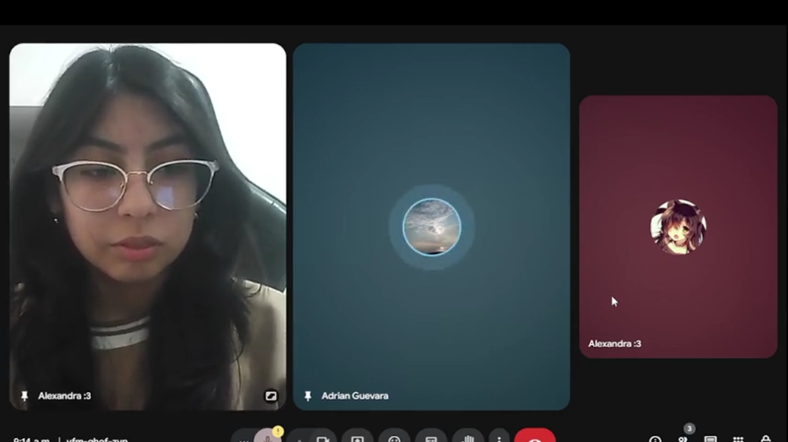
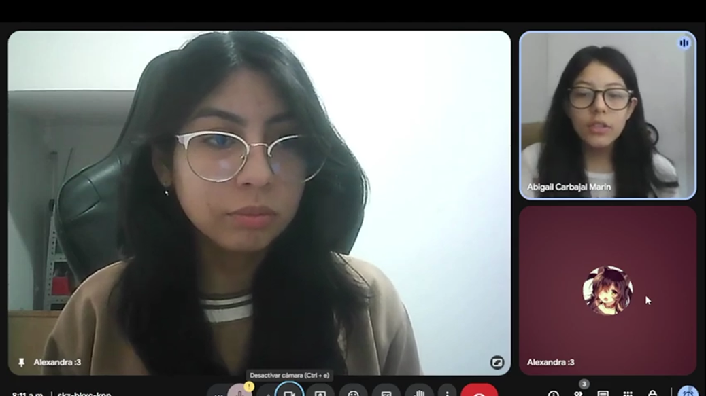
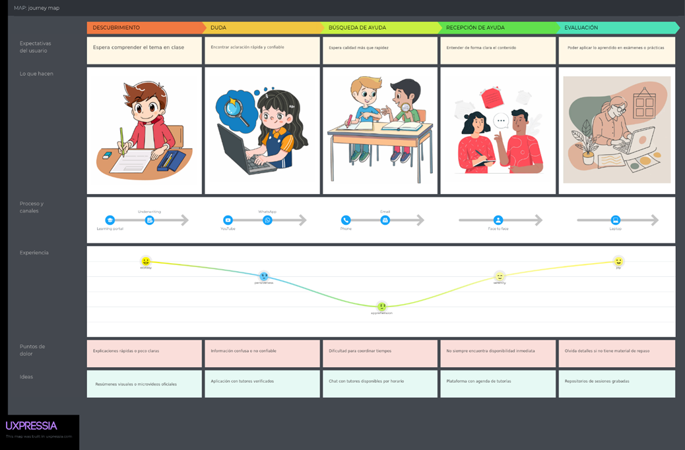
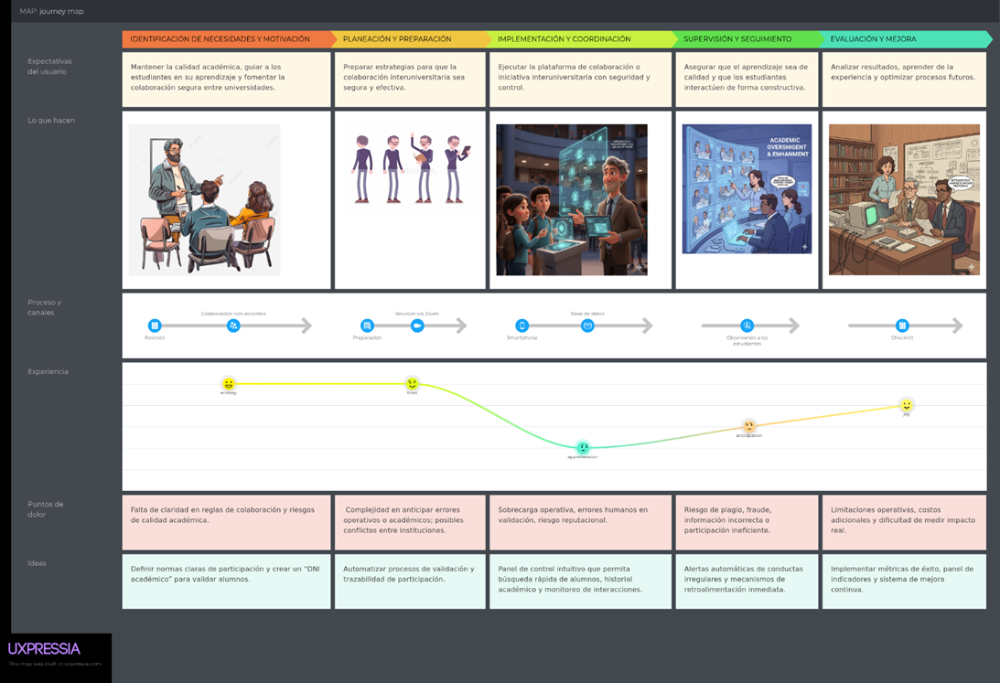
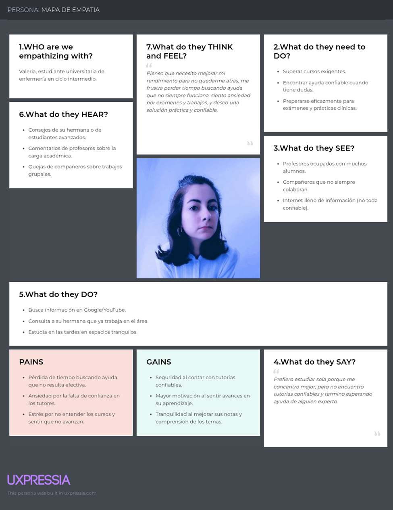

  

# UNIVERSIDAD PERUANA DE CIENCIAS APLICADAS
## Ingeniería de Software

**Período:** 2026-1  
**Curso:** 1ASI0730 | Aplicaciones Web  
**NRC:** 12190  
**Docente:** Hugo Allan Mori Paiva  

---

# INFORME DE TRABAJO FINAL

## Relación de integrantes

| Código | Apellidos y nombres |
| :--- | :--- |
| U201924127 | Alberca Saavedra, Victor Manuel |
| U201724692 | Komatsu Dueñas, David |
| [Completar] | [Completar] |

---

## Registro de Versiones del Informe

| Versión | Fecha | Autor | Descripción de modificación |
| :--- | :--- | :--- | :--- |
| **v.01.Tb1** | 19/04/2026 | Meza Soza, Alexandra Yamile Alberca Saavedra, Víctor Manuel Komatsu Dueñas, David | Se agregaron los tópicos correspondientes a los Capítulos I, II, III, IV y V, abarcando desde el Startup Profile y Requirements Elicitation, hasta la arquitectura, diseño UI/UX (Landing Page y Mobile) y el Sprint 1. |
| **v.01.Tp1** | [Fecha] | [Autor] | Se agregaron los siguientes tópicos: [Completar] |
| **v.01.Tb2** | [Fecha] | [Autor] | Se agregaron los siguientes tópicos: [Completar] |
| **v.01.Tf** | [Fecha] | [Autor] | Se agregaron los siguientes tópicos: [Completar] |

*(Nota: En la versión v.01.Tb1 he resumido la lista de capítulos para que la tabla sea legible en GitHub. Si necesitas el listado exhaustivo de cada subcapítulo, te recomiendo ponerlo fuera de la tabla).*

---

## Student Outcome

| Criterio específico | Acciones realizadas | Conclusiones |
| :--- | :--- | :--- |
| **Trabaja en equipo para proporcionar liderazgo en forma conjunta** | **Victor Alberca:** TB1: Participé en todo el proceso de desarrollo del proyecto, desde la investigación hasta la validación final...  **David Komatsu:** TB1: Realicé entrevistas para obtener información de la problemática... TP1: Encontré requerimientos de las funcionalidades... TB2: Realicé entrevistas de validación y analicé detalladamente... TF: Identifique partes del código con errores y duplicados...  **Alexandra Meza:** TB1: Realicé y registré entrevistas para conocer mejor las perspectivas... TP1: Diseñe los Wireframes y los mockups de los Landing Pages... TB2: A través de la elaboración de la landing page... TF: Durante la culminación del landing page e implementación... | En la TB1, el equipo realizó diversas actividades clave: análisis competitivo, entrevistas, diseño de User Personas y validación del documento...  En el TP1, el equipo se enfocó en analizar y estructurar de manera más profunda los problemas mediante To-Be Scenario Mapping, Impact Mapping, Historias de Usuario, Wireframes y Mockups...  En la TB2, el equipo realizó entrevistas de validación, detectó oportunidades de mejora en navegación y aplicó evaluaciones heurísticas...  En el TF, el equipo identificó y resolvió problemas complejos en navegación, consistencia visual, estructura de clases y código. |
| **Crea un entorno colaborativo e inclusivo, establece metas, planifica tareas y cumple objetivos** | **Victor Alberca:** TB1: Organicé y analicé la información de entrevistas...  **David Komatsu:** TB1: Con la información obtenida diseñe el empathy map... TP1: Alineamos las historias de usuario acorde a las necesidades... TB2: Con la información obtenida, precisé los requerimientos... TF: Registré el avance grupal de las nuevas funcionalidades...  **Alexandra Meza:** TB1: Tras analizar los datos, reconocí los comportamientos y lo agregué al User task Matrix... TP1: Para realizar el diseño de los wireframes, pensé en cómo incluir correctamente el tipo de diseño... TB2: Formulé los problemas encontrados estructurando los hallazgos... TF: Formulé patrones complejos de diseño para adaptar la interfaz... | En esta etapa, el equipo organizó la información para nutrir el User Task Matrix, el Empathy Map y los User Personas, y definió la problemática y el modelo de negocio...  Durante esta etapa, se formularon criterios de aceptación, el Product Backlog y flujos de navegación lógicos...  En la TB2, el equipo profundizó en la definición técnica mediante entrevistas y mejoró la arquitectura de la landing page...  En esta etapa final, se convirtieron problemas detectados en requisitos claros y se corrigieron fallas en diseño responsive y código. |

---

# Capítulo I: Introducción

## 1.1. Startup Profile

### 1.1.1. Descripción de la Startup

**Innovify** es una startup cuyo propósito es reducir la deserción académica conectando a estudiantes universitarios para que compartan conocimientos a través de sesiones de tutoría. Esta iniciativa resuelve de manera ágil las dudas específicas de los alumnos mediante dos modalidades integradas: un aprendizaje sincrónico, llevado a cabo en tiempo real a través de videollamadas incrustadas en la misma plataforma (mediante el consumo de APIs de video externas), y un aprendizaje asincrónico, que facilita el intercambio de materiales y recursos de estudio directamente en el entorno de la reserva.

A diferencia de los modelos tradicionales, nuestra plataforma se sostiene bajo un modelo de negocio mixto (B2C y B2B). Por el lado del estudiante (B2C), operamos bajo un sistema colaborativo de donaciones voluntarias; al finalizar una tutoría, el aprendiz puede realizar un aporte económico al tutor como agradecimiento, procesado mediante una pasarela de pagos segura, de la cual Innovify retiene una comisión del 5% para garantizar su sostenibilidad. Por el lado institucional (B2B), Innovify ofrece alianzas estratégicas a las universidades, brindándoles acceso a un Dashboard Analítico ("Termómetro Académico") que les permite visualizar estadísticas en tiempo real sobre los cursos con mayor demanda de tutorías, ayudándolas a prevenir la deserción estudiantil.

Todo este ecosistema se mantiene seguro y escalable gracias a un proceso de validación automatizada que exige el uso de correos institucionales (`.edu.pe` o `upc.edu.pe`, `pupc.edu.pe`) para garantizar que los usuarios sean estudiantes reales. Asimismo, la calidad académica está respaldada por la participación de los Profesores Universitarios, quienes actúan como garantes de excelencia al crear el banco oficial de quizzes y retos que los tutores utilizan para evaluar a sus aprendices, fomentando un entorno confiable, profesional y altamente colaborativo.

Asimismo, pensando en la escalabilidad y el aseguramiento de la calidad a futuro, Innovify contempla la integración de tecnología IoT en su ecosistema. El roadmap tecnológico incluye el desarrollo de un **'Sensor de Calidad de Entorno'**: un dispositivo miniatura basado en un microcontrolador (ej. ESP32) equipado con sensores de luz y ruido, diseñado para ubicarse en el área de estudio del tutor. Durante el aprendizaje sincrónico, este hardware enviará métricas ambientales en tiempo real al backend. Si el entorno presenta contaminación auditiva o iluminación deficiente, la plataforma alertará al tutor para que mejore sus condiciones. Por el contrario, parámetros óptimos otorgarán automáticamente un 'Badge de Excelencia Técnica' a la sesión. Esta proyección IoT asegura que el servicio por el cual el aprendiz realiza su donación económica mantenga siempre un estándar de alta calidad profesional.

### Visión
Ser la plataforma líder en educación colaborativa universitaria a nivel nacional, reconocida por ser el principal aliado estratégico de las instituciones en la prevención de la deserción académica, potenciando el aprendizaje mediante tecnología escalable, entornos validados por IoT y un ecosistema económicamente sostenible.

### Misión
Facilitar el aprendizaje sincrónico y asincrónico entre estudiantes universitarios proporcionando herramientas digitales integradas, seguras y automatizadas. Promovemos la excelencia académica, la mejora de habilidades blandas y la recompensa justa al esfuerzo del tutor mediante donaciones voluntarias, operando bajo un entorno validado institucionalmente que brinda data de valor a las universidades para optimizar sus planes de estudio.
### 1.1.2. Perfiles de integrantes del equipo

| Foto | Integrante | Carrera | Descripción |
| :---: | :--- | :--- | :--- |
|  | **Alberca Saavedra, Victor Manuel** (U201924127) | Ingeniería de Software | Puedo aportar mis conocimientos básicos de investigación para los temas y tengo experiencia en el leguaje C++. También puedo aportar al grupo con el aspecto comunicativo y organizativo para si poder realizar un mejor trabajo. |
|  | **Komatsu Dueñas, David** (U201724692) | Ingeniería de Software | Me gustaría aportar a este proyecto con mis conocimientos adquiridos en investigación y sus respectivas metodologías, y la experiencia universitaria adquirida en el lenguaje C++ y JavaScript. También, aportare con mis habilidades de comunicación asertiva y buen trabajo en equipo. |
|  | **[Nombre Integrante 3]** ([Código]) | Ingeniería de Sistemas de Información | Estudiante de Ingeniería de Sistemas de Información con enfoque en análisis de datos y desarrollo básico en Python/C++. Me caracterizo por aprendizaje rápido, criterio para filtrar información relevante y trabajo colaborativo. En el equipo aporto investigación aplicada y prototipos técnicos que conectan los hallazgos con funcionalidades del producto. |
|  | **[Nombre Integrante 4]** ([Código]) | Ingeniería de Sistemas de Información | Estudiante de la carrera de ingeniería de sistemas en la UPC. Domino C#, Java, C++ y me gusta trabajar en equipo para lograr un objetivo. Tengo habilidades además de programar con el diseño. En el equipo aportaré a nuestra landing page con mis conocimientos, un diseño limpio y agradable para el usuario. |
|  | **[Nombre Integrante 5]** ([Código]) | Ingeniería de Sistemas de Información | Puedo aportar mis conocimientos en C++ y Python. Además de la generación de tablas y gráficos estadísticos desde la depuración de un mismo código y el acceso a una base de datos desde las hojas de cálculo de Excel en sus diferentes formatos hasta base de datos en SQL Server. |
|  | **[Nombre Integrante 6]** ([Código]) | Ingeniería de Software | Me gustaría aportar a este proyecto con mis conocimientos en programación en los lenguajes C++, Python, HTML y CSS. Asimismo, puedo contribuir al equipo con habilidades en trabajo colaborativo, organización y resolución de problemas. |

*(Tabla 1. Perfiles integrantes de equipo - Elaboración propia. Nota: En esta tabla se aprecia los perfiles de los integrantes de equipo).*

---

## 1.2. Solution Profile

### 1.2.1. Antecedentes y problemática

En el Perú, el fracaso académico, manifestado mediante un bajo rendimiento académico, la reprobación de cursos y la deserción, es un problema que afecta a varios estudiantes de diversas universidades, tanto públicas como privadas. De acuerdo con el Minedu (2021), la tasa de interrupción de estudios en universidades licenciadas llegó a 11,5% en el ciclo 2021-1, siendo Lima una de las regiones con tasas de deserción más altas, con un 12,4%.

Diversos estudios asocian un ambiente de aprendizaje inadecuado y una enseñanza poco satisfactoria como parte de las causas de este problema, así como factores mentales y emocionales como la falta de apoyo social, bajos niveles de motivación intrínseca y falta de autoestima (Escalante et al., 2023).

Si bien estas causas son multifactoriales, nuestra investigación identifica un problema subyacente y desatendido: **el aislamiento del conocimiento**. Cada universidad, con sus fortalezas y debilidades, funciona como una isla académica. El talento y la pericia de sus estudiantes permanecen encapsulados dentro de sus propios campus, desaprovechando una vasta red de conocimiento distribuido a nivel nacional. Actualmente, no existe un puente formal, seguro y confiable que permita a un estudiante de una universidad A, que necesita ayuda en un tema específico, conectar con un par de la universidad B que domine esa área. Los estudiantes se ven limitados a su círculo inmediato o a grupos informales en redes sociales que carecen de seguridad y verificación.

Esto no solo impacta negativamente en el bienestar social y económico de los mismos estudiantes sino también en la capacidad productiva del país por falta de mano de obra calificada, agravando problemas socioeconómicos como los niveles de vida deficientes, las altas tasas de desempleo y el incremento de comportamientos disruptivos en la sociedad (Escalante et al., 2023).

Para conocer aún más la problemática usaremos la técnica de las **5W y 2H**:

#### What (¿Qué? / ¿Cuál?)
* **¿Cuál es el problema?** El problema es la deserción universitaria ocasionada por diversos factores tales como falta de aprendizaje, estrés académico, bajos niveles económicos, etc. Por consecuencia, muchos estudiantes terminan suspendiendo sus estudios universitarios y, en el peor de los casos, muchos de ellos nunca llegan a terminarlos.
* **¿Qué soluciones existen actualmente?** Actualmente existen plataformas académicas como *[Colocar las empresas aquí]*. Sin embargo, en el país no han alcanzado gran popularidad debido al limitado impacto que han tenido en la comunidad universitaria peruana. Con nuestra propuesta de valor buscamos generar ese impacto a través de un sistema de conexión entre estudiantes, facilitando un aprendizaje sincrónico mediante videollamadas integradas y asincrónico a través de recursos compartidos, todo esto bajo un modelo sostenible de donaciones voluntarias.
* **¿Cuál es la relación con el usuario?** El usuario es el eje central de nuestra plataforma, ya que es quien le da vida mediante la realización de consultas y el intercambio de conocimientos. En caso de asumir el rol de tutor, también tendrá la responsabilidad de guiar al aprendiz, recibiendo donaciones monetarias por su tiempo invertido, lo que aporta mayor seguridad y confianza al ecosistema.

#### Why (¿Por qué?)
* **¿Cuál es la causa principal del problema?** Consideramos que, si bien en la primera pregunta del segmento "What" se mencionaron diversas causas, todas confluyen en un mismo problema principal: no todos los estudiantes logran comprender completamente los temas en clase. Con frecuencia, el tiempo resulta insuficiente y varios de ellos quedan con dudas sin resolver debido a distintos factores. Por esta razón, muchos recurren a estrategias de aprendizaje que no siempre se adaptan a ellos.

#### Who (¿Quién?)
* **¿Quiénes están involucrados?** Está involucrada toda la comunidad universitaria, incluidos estudiantes y profesores, así como los rectores.
* **¿A quiénes les sucede el problema?** Estudiantes universitarios hispanohablantes que necesiten ayuda para resolver dudas inconclusas de sus clases, así como tutores que deseen ayudar a otros alumnos a concluir sus estudios de manera satisfactoria.

#### When (¿Cuándo?)
* **¿Cuándo sucede el problema?** Constantemente, en el Perú las cifras de deserción universitaria son inmensas y más en estos últimos años en que los trabajos y las empresas en general se mueven más por contactos y experiencia, dejando en un segundo plano e infravalorando a los estudios universitarios.
* **¿Cuándo el cliente usa el producto?** Cuando uno de los muchos estudiantes universitarios tiene dudas que no fueron resueltas en clase y no disponen de mucho tiempo para leerse libros inmensos con toda la teoría o necesitan ejemplos que se adaptan más a su velocidad de aprendizaje.

#### Where (¿Dónde?)
* **¿Dónde está el usuario cuando usa la plataforma?** En su lugar favorito dedicado al estudio, no es un lugar en específico y en su mayoría depende mucho de las preferencias y disponibilidad del estudiante. Comúnmente son espacios universitarios dedicados al estudio, salas de estudio dentro de las casas o habitaciones en silencio para la concentración del estudiante o tutor.
* **¿Dónde surge el problema?** En las universidades y sus sistemas que muchas veces no terminan de complementarse bien con el estudiante.

#### How (¿Cómo?)
* **¿En qué condiciones los clientes usan nuestro producto?** Los clientes usan nuestro producto cuando tienen dudas que necesiten resolver, cuando deseen estudiar para un examen o simplemente tengan tiempo libre y quieran ayudar a otros universitarios, ya que de todas maneras serán recompensados.
* **¿Cómo se enteran de la aplicación?** A través de redes sociales, pruebas piloto dentro de nuestra universidad y la recomendación de su uso por parte de contactos o profesores.

#### How much (¿Cuánto?)
* **¿Cuánto le cuesta este problema a la economía, sociedad o institución del Perú actualmente?** Actualmente la educación universitaria está siendo respaldada en gran parte por el gobierno, ya que se conoce que se realizó un incremento de presupuesto del 24% respecto al año 2023, lo que significan unos S/8 416 millones en total (Gobierno del Perú, 2024).
* **¿Cuánto costaría implementar la solución propuesta?**
  * Desarrollo web MVP: S/ 19,000 - S/38,000
  * Aplicación móvil (híbrida): S/19,000 - S/30,400
  * Integración de APIs, videollamada y pasarela de pagos: S/ 3,000 - S/6,000
  * Diseño UI/UX: S/ 3,040 - S/7,600
  * Dominio + hosting: S/570 - S/1,900
  * Seguridad y soporte: S/ 2,280 - S/6,080

---

### 1.2.2. Lean UX Process

#### 1.2.2.1. Lean UX Problem Statements
Nuestra plataforma se enfoca en crear una red de aprendizaje colaborativo e intercambio de conocimientos exclusivamente entre estudiantes de distintas universidades peruanas. Buscamos romper los silos académicos tradicionales para que los estudiantes puedan complementar su formación, resolver dudas y desarrollar nuevas competencias con pares que de otra manera no conocerían. La plataforma facilitará un entorno de apoyo mutuo: los estudiantes podrán recibir ayuda sincrónica (videollamadas) o asincrónica (materiales compartidos), y los tutores serán recompensados con donaciones voluntarias de las cuales la plataforma retendrá un 5% de comisión para asegurar su sostenibilidad.

La problemática que abordamos es el fracaso y la deserción académica en el sistema universitario peruano, un fenómeno agravado por el aislamiento estudiantil y la falta de acceso a perspectivas académicas. Según datos del MINEDU (2021), la tasa de interrupción de estudios alcanzó el 11.5%, siendo Lima una de las regiones más afectadas (12.4%). Este fenómeno se relaciona con bajos niveles de motivación y entornos de aprendizaje poco satisfactorios, donde muchos estudiantes no encuentran el soporte necesario para superar cursos o desarrollar habilidades específicas.

Hemos observado que, si bien cada universidad cuenta con talento y fortalezas específicas, este conocimiento permanece encapsulado dentro de sus propios campus. Un estudiante de la UNI puede tener una habilidad en cálculo que un estudiante de la UPC necesita, y viceversa, este último puede dominar una herramienta de diseño crucial para el primero. El problema central es la inexistencia de un puente formal y seguro que conecte a estos estudiantes, lo que genera una brecha de oportunidad y desaprovecha un valioso capital de conocimiento distribuido en el país. Las soluciones informales actuales, como los grupos en redes sociales, carecen de sistemas de verificación y confianza, exponiendo a los alumnos a riesgos e interacciones de baja calidad.

A raíz de esta problemática, nuestra propuesta busca responder a la siguiente pregunta: **¿Cómo podríamos crear un ecosistema digital que conecte a estudiantes de distintas universidades peruanas para que enseñen y aprendan de forma segura, fomentando el apoyo mutuo de forma sincrónica y asincrónica, bajo un modelo de negocio sostenible de donaciones voluntarias?**

#### 1.2.2.2. Lean UX Assumptions
Para abordar de manera efectiva la problemática del fracaso académico y la deserción universitaria, es fundamental partir de una serie de supuestos sobre nuestros usuarios y su contexto. El éxito de Innovify depende de qué tan acertadas sean estas hipótesis centradas en el usuario tecnológico y en nuestro modelo de negocio sostenible.

Nuestro análisis del entorno universitario peruano revela que los estudiantes enfrentan barreras académicas que limitan su progreso. Suponemos que existe un vacío en su experiencia de aprendizaje, y que muchos buscan activamente apoyo personalizado. Creemos que los estudiantes valoran recibir clases de pares de otras universidades, siempre que el entorno cuente con herramientas integradas que faciliten un aprendizaje sincrónico (en vivo) y asincrónico (intercambio de materiales).

Asimismo, identificamos que la falta de incentivos reales frena la colaboración continua. En cuanto a la motivación, creemos que los estudiantes con buen rendimiento académico (Tutores) están dispuestos a invertir su tiempo si pueden reforzar su propio aprendizaje y, a la vez, ser recompensados mediante un sistema de donaciones voluntarias por su esfuerzo.

Nuestra propuesta se distinguirá al ofrecer una plataforma centralizada y verificada. Innovify integrará funcionalidades clave mediante servicios de terceros (APIs de videollamada y pasarelas de pago) para que los estudiantes no tengan que salir de la aplicación, generando así un ecosistema seguro, estructurado y económicamente sostenible gracias a la retención de una pequeña comisión (5%) por cada donación procesada.

##### Assumptions Worksheet

| Pregunta | Respuesta |
| :--- | :--- |
| **¿Quién es el usuario?** | Nuestros usuarios son estudiantes universitarios peruanos de diversas carreras que se dividen en dos roles principales: 1. **El Aprendiz:** Estudiante universitario que se siente estancado en ciertos temas y valora la ayuda en tiempo real (sincrónica) o mediante materiales compartidos (asincrónica). 2. **El Tutor:** Estudiante que domina una materia, motivado por ayudar a otros, consolidar sus conocimientos y recibir donaciones económicas voluntarias por su tiempo. |
| **¿Dónde encaja nuestro producto en su trabajo o vida?** | Creemos que los estudiantes buscarán apoyo fuera de su horario de clases regular, prefiriendo organizar videollamadas en horarios flexibles sin tener que depender de aplicaciones externas inseguras. |
| **¿Qué problemas tiene nuestro producto a resolver?** | • **Problema de Herramientas Fragmentadas:** Asumimos que los estudiantes se frustran al tener que usar WhatsApp para coordinar, Drive para materiales y Zoom para la clase. Todo debe estar integrado. • **Problema de Sostenibilidad e Incentivo:** Asumimos que los tutores se desmotivan si no ven un beneficio tangible. El sistema de donaciones resuelve esto, y la comisión del 5% resuelve la sostenibilidad del negocio. • **Problema de Seguridad:** Asumimos que interactuar con estudiantes de otras universidades genera fricción si no hay un Administrador/Verificador validando las cuentas y moderando reportes. |
| **¿Cuándo y cómo es nuestro producto usado?** | El uso se intensificará en picos de estrés académico (semanas de parciales/finales). Los alumnos agendarán sesiones en vivo (sincrónicas) o enviarán documentos para revisión (asincrónico) de manera centralizada. |
| **¿Qué características son importantes?** | • **Videollamada Integrada:** Es fundamental que la clase ocurra dentro de la plataforma usando una API externa. • **Pasarela de Pagos Confiable:** Para procesar las donaciones de forma rápida y segura. • **Seguridad y Moderación:** Un panel donde el Verificador pueda atender reportes y asegurar la calidad. |
| **¿Cómo debe verse nuestro producto y cómo comportarse?** | Creemos que la experiencia debe sentirse segura, confiable y colaborativa. El usuario debe percibir la plataforma como un entorno académico serio, pero a la vez solidario y de apoyo mutuo, no como una red social informal. |

##### Definición de Objetivos

**Business outcomes**
* Fomentar la colaboración y reducir el aislamiento académico entre universidades.
* Contribuir a la disminución de la tasa de deserción estudiantil por fracaso académico.
* Posicionar la plataforma como la red de apoyo estudiantil interuniversitaria líder en el Perú.
* Establecer alianzas estratégicas con universidades para facilitar los procesos de validación.
* Lograr un modelo de negocio sostenible captando el 5% de comisión de las donaciones.
* Fomentar el aprendizaje interuniversitario sincrónico y asincrónico.

**User outcomes**
* Mejorar el rendimiento académico y la comprensión de temas complejos.
* Reducir el estrés y la ansiedad asociados a los desafíos académicos.
* Adquirir nuevas habilidades prácticas y teóricas de forma accesible.
* Ampliar su red de contactos con pares de otras disciplinas y universidades.
* Aumentar su confianza al poder enseñar y validar sus propios conocimientos.
* Generar ingresos económicos extra para los tutores a través de su esfuerzo.

**Features**
* Sistema de registro y verificación de identidad gestionado por un Coordinador.
* Creación de perfiles de estudiante con secciones diferenciadas para "Habilidades para Enseñar" y "Habilidades para Aprender".
* Motor de búsqueda con filtros por habilidad y universidad, con bloqueo de emparejamiento para la misma institución.
* Sistema de solicitudes de intercambio con mensajería personalizada.
* Chat integrado para la coordinación segura entre los estudiantes emparejados.
* Sistema de calificación mutua y reseñas visibles en los perfiles de usuario.
* Integración de API de videollamadas (ej. Agora o Zoom SDK) para el aprendizaje sincrónico.
* Chat interno con soporte para subir archivos (aprendizaje asincrónico).
* Integración de API de pasarela de pagos (ej. Stripe o MercadoPago) para procesar las donaciones voluntarias y retener automáticamente el 5% de comisión.

#### 1.2.2.3. Lean UX Hypothesis Statements

**Hipótesis de Negocio**
* Creemos que al implementar un sistema de registro y verificación automática exclusiva con correos institucionales (".edu.pe") para todos los estudiantes, resultará en una superación de la barrera de desconfianza inicial y un ingreso más ágil sin validación manual, lo que facilitará la adopción de la plataforma; sabremos que esto es cierto cuando el 90% de los nuevos usuarios complete su registro en las primeras 24 horas y la tasa de reportes por cuentas falsas o suplantación sea cercana a 0%. 
* Creemos que al diseñar un modelo de donaciones voluntarias mediante una pasarela de pagos con una comisión del 5%, resultará en un modelo de negocio sostenible y en una comunidad donde los tutores se mantengan motivados, evidenciándose cuando al menos el 60% de las sesiones incluyan una donación y los ingresos cubran los costos operativos al finalizar el primer año. 
* Finalmente, creemos que al implementar un sistema de calificaciones y reseñas mutuas tras cada sesión, resultará en una comunidad basada en la reputación y la meritocracia, incentivando la calidad de las tutorías; sabremos que esto es cierto cuando más del 75% de las sesiones reciban calificaciones de ambas partes y los tutores con promedio superior a 4.5 estrellas obtengan un 30% más de solicitudes y donaciones.

**Hipótesis de Usuario**
* Creemos que al ofrecer un motor de búsqueda con filtros por habilidad y universidad para los estudiantes "aprendices", resultará en la capacidad de encontrar apoyo específico que no hallan en su entorno inmediato, facilitando conexiones más precisas dentro de la plataforma; sabremos que esto es cierto cuando el 70% de las búsquedas con filtros conduzcan a una solicitud de ayuda y el 60% de los nuevos aprendices completen una sesión exitosa en sus primeras dos semanas.
* Creemos que al integrar un sistema de aprendizaje sincrónico (videollamadas incrustadas vía API) y asincrónico (chat para intercambio de materiales), resultará en una mayor retención, comodidad y percepción de seguridad al no depender de enlaces externos vulnerables; sabremos que esto es cierto cuando más del 90% de las tutorías programadas se realicen exclusivamente dentro de la sala virtual y la satisfacción técnica de la llamada alcance una calificación promedio de 4.5/5.
* Creemos que al facilitar conexiones de tutoría interuniversitarias, los estudiantes "aprendices" lograrán mejorar su rendimiento académico en cursos de alta dificultad, fortaleciendo su confianza y comprensión; sabremos que esto es cierto cuando el 75% de los aprendices reporte en encuestas posteriores un aumento significativo en su confianza y dominio del tema. 
* Finalmente, creemos que al ofrecer una plataforma estructurada y monetizable para enseñar, los estudiantes "tutores" podrán desarrollar competencias académicas y blandas mientras generan ingresos extra, lo que incentivará su participación continua; sabremos que esto es cierto cuando el 80% de los tutores activos reporte que enseñar les ayudó a consolidar su conocimiento y cuando el 50% de los tutores recurrentes logre generar al menos una donación mensual.
#### 1.2.2.4. Lean UX Canvas

| LEAN UX CANVAS | |
| :--- | :--- |
| **Título:** SkillSwap Lean UX Canvas | **Fecha:** 03/04/2026 |
| **Iteración:** 1 | |
| **1. Problema de negocio** Las plataformas actuales fragmentan el aprendizaje (usan links externos inseguros) y carecen de un modelo de negocio sostenible. Además, no garantizan la identidad de los usuarios, generando desconfianza. | **5. Solución** La plataforma integra una API de videollamadas que permite un entorno sincrónico directamente en la web, junto con un espacio asincrónico mediante un chat interno donde se pueden adjuntar materiales de estudio. Además, incorpora un modelo de donaciones a través de una API de pagos que facilita propinas voluntarias, reteniendo un 5% de comisión, y cuenta con un panel de verificador que funciona como dashboard para aprobar usuarios y moderar la comunidad. |
| **2. Resultados comerciales** Se busca lograr ingresos sostenibles mediante el cobro del 5% de comisión sobre cada donación, asegurar que el 100% de las sesiones sincrónicas se realicen dentro de la plataforma y alcanzar la verificación de la mayoría de los usuarios activos. | **6. Hipótesis** • Creemos que, al integrar una API de videollamadas, aumentará la retención de usuarios al no tener que salir de la página. • Creemos que un modelo de donaciones voluntarias incentivará a los tutores a dar un mejor servicio. • Creemos que cobrar un 5% de comisión a las donaciones hará que el software sea un negocio sostenible. • Creemos que el rol de Verificador mantendrá la tasa de reportes por fraude al mínimo. • Creemos que permitir a un usuario cambiar fácilmente entre los roles de tutor y aprendiz, incrementará la participación y el tiempo en la plataforma. • Creemos que incorporar un sistema de reportes visible y fácil de usar, reducirá los incidentes negativos y aumentará la tasa de retención de usuarios a largo plazo al sentirse más protegidos. • Creemos que diseñar una interfaz sencilla con un guiado para usuarios con poca experiencia digital, disminuirá la tasa de abandono durante el registro en un 30% y mejorará la calificación de satisfacción general. |
| **3. Usuarios y clientes** • Joven peruano que busca mejorar sus notas, aprender nuevas habilidades o ganar experiencia enseñando. • Personal administrativo o académico designado por la universidad. | **7. ¿Qué es lo más importante que necesitamos aprender primero?** • ¿Están dispuestos los alumnos peruanos a donar dinero real por una buena tutoría de un par? • ¿Una comisión del 5% será aceptada por los tutores sin generar rechazo? • ¿Las APIs de videollamada funcionarán fluidamente en las conexiones a internet promedio de los estudiantes? |
| **4. Beneficios del usuario** La plataforma permite un aprendizaje integral en un solo lugar sin depender de aplicaciones de terceros, facilita la generación de ingresos extra para los tutores en función de la calidad de su enseñanza y garantiza un entorno completamente verificado y moderado. | **8. ¿Cuál es la menor cantidad de trabajo que necesitamos hacer para aprender la siguiente cosa más importante?** • Realizar entrevistas para validar la disposición a donar. • Desarrollar un MVP web que conecte las APIs de videollamada y pasarela de pago para probar la funcionalidad técnica y la fluidez del aprendizaje sincrónico. |

*(Tabla 2. Lean Ux Canvas - Elaboración propia. Nota: Este Lean UX Canvas resume la propuesta de diseño centrado en el usuario para la plataforma SkillSwap, que busca conectar estudiantes de distintas universidades peruanas mediante tutorías seguras y validadas institucionalmente).*

---

## 1.3. Segmentos objetivo

### Segmento objetivo #1: Estudiantes que quieran aprender
Son estudiantes universitarios, generalmente entre 18 y 25 años, de pregrado, residentes en zonas urbanas con acceso a internet y dispositivos digitales, pertenecientes a universidades privadas o públicas. Enfrentan dificultades académicas en materias específicas y suelen sentirse estancados con los métodos de enseñanza de su propia institución o no encuentran ayuda personalizada dentro de su círculo cercano.

Están dispuestos a compensar económicamente el esfuerzo de sus pares mediante donaciones voluntarias a cambio de una tutoría de calidad, ya sea en formato sincrónico (videollamadas) o asincrónico (materiales). Según un estudio académico (García Ortiz, López de Castro Machado y Rivero Frutos, 2020), el 40 % de los estudiantes considera insuficiente el tiempo que dedica al estudio, casi un tercio mantiene asignaturas pendientes y el 37 % ha pensado en abandonar el grado. Entre las soluciones más mencionadas por los propios alumnos se encuentran las tutorías personalizadas y la organización de grupos de estudio, lo que confirma la necesidad de un acompañamiento académico más cercano.

### Segmento objetivo #2: Estudiantes que quieran enseñar
Son estudiantes universitarios con un dominio notable en ciertas áreas académicas, generalmente entre 19 y 27 años, en ciclos intermedios o avanzados de la carrera, proactivos y motivados por la experiencia docente. Buscan reforzar su propio aprendizaje y generar ingresos económicos extra mediante las donaciones que reciben en la plataforma, al mismo tiempo que desarrollan habilidades blandas como liderazgo, comunicación efectiva y creatividad, que son altamente valoradas en el mercado laboral. 

Según un estudio de Gutiérrez Pallares, Bernal Pérez y Gutiérrez Pallares (2024), en Latinoamérica los egresados universitarios presentan debilidades en la comunicación, el manejo emocional y la creatividad, pese a que estas competencias son consideradas esenciales por los empleadores. Por ello, las universidades están llamadas a promover proyectos colaborativos, tutorías y prácticas que fortalezcan dichas competencias.

### Segmento objetivo #3: Coordinador Institucional
Es personal académico, administrativo o de soporte técnico, generalmente entre 30 y 55 años, con formación en educación, psicología o gestión de plataformas digitales. Su principal objetivo ya no es la validación manual de cuentas (puesto que esto se realiza automáticamente mediante el correo: `.edu.pe`), sino velar por la integridad, seguridad y moderación del ecosistema. 

Se encargan de atender reportes de mala conducta, monitorear el correcto flujo de las donaciones y garantizar que la plataforma sea un entorno confiable. Según un análisis sobre legitimidad organizacional (Suchman, 1995; Ruef & Scott, 1998), la reputación de una institución depende de la percepción de sus acciones como correctas, deseables y alineadas a normas aceptadas socialmente. En este sentido, los coordinadores institucionales juegan un papel clave en asegurar que las universidades mantengan legitimidad y confianza frente a estudiantes y otros grupos de interés.
# Capítulo II: Requirements Elicitation & Analysis

## 2.1. Competidores

**uDocz (Competidor Directo)**
uDocz es una plataforma de origen peruano que se ha expandido por toda Latinoamérica, posicionándose como una de las comunidades de estudio más grandes para universitarios de habla hispana. Su modelo se centra en que los estudiantes compartan y encuentren material de estudio, como apuntes de clase, resúmenes, guías y solucionarios, específicos para su universidad y carrera. Aunque su fuerte es el intercambio de documentos, también ha incorporado funciones para hacer preguntas y recibir respuestas de la comunidad.

**Knack (Competidor Directo)**
Knack es una red de tutoría universitaria norteamericana que conecta a estudiantes con tutores pares que han sobresalido en cursos específicos. La plataforma se asocia directamente con las universidades, las cuales a menudo subsidian el costo, haciendo que las tutorías sean gratuitas para los estudiantes. Su modelo se enfoca en que los alumnos reciban ayuda de compañeros que ya han aprobado (generalmente con excelentes notas) las mismas materias en la misma institución.

**GoPeer (Competidor Indirecto)**
GoPeer es una plataforma en línea que conecta a estudiantes de primaria y secundaria con tutores que son estudiantes universitarios de instituciones prestigiosas. Su modelo de negocio se basa en ofrecer tutorías asequibles y de alta calidad, aprovechando el conocimiento y la cercanía generacional de los universitarios para enseñar a alumnos más jóvenes. Si bien utiliza a estudiantes universitarios como la fuente de conocimiento (los tutores), su mercado objetivo (los aprendices) es completamente diferente.

---

### 2.1.1. Análisis competitivo

| Criterio de Análisis |  **SkillSwap / Innovify** |  **uDocz** |  **Knack** |  **GoPeer** |
| :--- | :--- | :--- | :--- | :--- |
| **Overview** | Plataforma de aprendizaje colaborativo mediante videollamadas integradas. Ecosistema de donaciones voluntarias (B2C), calidad garantizada, validación automática (`.edu.pe`) y modelo B2B analítico. | Comunidad masiva para universitarios, centrada en el intercambio de material de estudio (apuntes, resúmenes) para cursos y universidades específicas. | Red de tutoría *peer-to-peer* que opera dentro de una misma universidad. Conecta estudiantes con tutores que aprobaron los mismos cursos, a menudo con subsidio de la universidad. | Conecta estudiantes universitarios (tutores) con alumnos de primaria y secundaria para sesiones en línea. Servicio unidireccional. |
| **Ventaja competitiva** | **Recompensa Económica:** Donaciones que reconocen el valor. **Calidad Validada:** Quizzes aplicados por profesores. **Data Estratégica:** Dashboards B2B para prevenir deserción. | Acceso a un repositorio masivo y específico. Fuerte efecto de red: a más usuarios, más valiosa se vuelve la plataforma. | Hiper-conveniencia y confianza (tutor es un compañero de la misma universidad). Suele ser gratuito para el estudiante (financiado por la universidad). | Tutores de alta calidad a un costo asequible. Aprovecha la cercanía generacional entre universitarios y escolares. |
| **Mercado objetivo** | Estudiantes universitarios de pregrado (B2C) y Universidades/Profesores que buscan analítica de rendimiento (B2B). | Estudiantes universitarios de habla hispana que buscan material de apoyo. Enfoque masivo para todas las carreras. | **Primario:** Estudiantes de universidades asociadas. **Secundario (el que paga):** Universidades que contratan la plataforma. | **Primario (el que paga):** Padres de escolares. **Secundario:** Universitarios que buscan un trabajo flexible. |
| **Estrategias de marketing** | Venta directa B2B a universidades. Marketing digital dirigido en redes sociales. Programa de Embajadores en cada campus. | Fuerte marketing de contenidos y SEO. Modelo viral ("sube un documento para descargar otro") y publicidad en redes. | Estrategia B2B de venta directa a administraciones universitarias. Promoción a través de canales de comunicación internos. | Estrategia B2C con publicidad digital dirigida a padres. Relaciones públicas y marketing de referidos. |
| **Productos & Servicios** | Emparejamiento de estudiantes. Roles flexibles (Tutor/Aprendiz). Videollamadas integradas (API), Chat, Banco de Quizzes y Dashboard Analítico. | Repositorio de documentos, comunidad de preguntas/respuestas, y herramientas de estudio básicas (ej. flashcards). | Plataforma SaaS para gestionar programas de tutorías, agendamiento, comunicación y analítica de datos. | Marketplace de tutorías con aula virtual integrada (videochat, pizarra). Gestionan agendamiento y pagos. |
| **Precios & Costos** | **Plan Gratuito:** Monetización vía retención del 5% de donaciones. **Licencia B2B:** Membresía a universidades por el Dashboard. | **Freemium:** Acceso básico gratuito con descargas limitadas. Premium pagando suscripción o subiendo documentos. | Suscripción o licencia anual pagada por la universidad. Para el estudiante es gratuito. Los tutores reciben pago por hora. | Los padres pagan tarifa por hora. GoPeer toma comisión de esa tarifa o cobra membresía. |
| **Canales de distribución** | Móvil y web | Móvil y web | Web | Web |
| **Fortalezas (SWOT)** | Registro sin fricción (`.edu.pe`). Donaciones incentivan calidad. Validación académica por profesores. Modelo B2C y B2B sostenible. | Enorme base de usuarios y contenido. Fuerte reconocimiento de marca. Crecimiento orgánico de bajo costo. | Modelo B2B estable. Alta confianza garantizada por la universidad. Máxima adopción estudiantil. | Mercado muy grande y constante. Propuesta de valor atractiva para padres. Tutores prestigiosos generan confianza. |
| **Debilidades (SWOT)** | Requiere masa crítica de usuarios inicial. Depende de la cooperación universitaria. Dependencia de APIs externas. | Calidad de contenido sin verificar. No ofrece tutorías personalizadas en tiempo real. Riesgo de uso antiético (fraude). | Crecimiento lento (largos ciclos de venta). Modelo cerrado que impide networking interuniversitario. | Mercado K-12 muy competitivo. Baja retención si no hay necesidad constante. No ataca nicho universitario. |
| **Oportunidades (SWOT)** | Aumento del aprendizaje en línea. Desarrollo de habilidades blandas. Escalable a Latinoamérica. Universidades invierten en retención. | Expandirse a tutorías en vivo. Implementar IA para verificar calidad. Alianzas con creadores de contenido. | Expandirse a mercados internacionales. Ofrecer mentoría profesional o preparación para posgrados. | Expandirse a exámenes de admisión. Alianzas con colegios. Tutorías grupales para reducir costos. |
| **Amenazas (SWOT)** | Grupos de WhatsApp/Discord. Burocracia universitaria y lentitud de adopción. Reto de rentabilidad en modelo gratuito. | Políticas universitarias estrictas. Nuevos competidores con IA. Dependencia de contenido de usuarios. | Recortes presupuestarios en universidades. Burocracia para adopción. Soluciones más flexibles. | Intensa competencia online. Alta sensibilidad al precio por padres. Costos de marketing elevados. |

*(Tabla 3. Análisis competitivo-Landscape - Elaboración propia. Nota: Esta tabla presenta una comparación detallada entre SkillSwap y otras plataformas para consolidar su propuesta única).*

---

### 2.1.2. Estrategias y tácticas frente a competidores

A continuación, se presentan las estrategias y tácticas que Innovify / SkillSwap puede implementar para destacarse frente a competidores que ofrecen apoyo académico, capitalizando su modelo único de colaboración interuniversitaria, su sostenibilidad financiera y su rigor académico.

#### Estrategias

* **Diferenciación por Exclusividad y Networking:** A diferencia de Knack (limitado a un solo campus) y de uDocz (intercambio impersonal de documentos), Innovify se posiciona como una red nacional de talento universitario validado. Nuestro valor diferencial no es solo conectar estudiantes, sino garantizar que la enseñanza sea de alta calidad mediante el uso del Banco Oficial de Quizzes creado exclusivamente por Profesores Universitarios.
* **Construcción de Confianza a través de la Verificación:** A diferencia de la anonimidad de uDocz o los grupos de WhatsApp, garantizaremos la identidad de cada usuario mediante un sistema de validación automática con correos institucionales (`.edu.pe`). Esto nos posicionará como la opción más segura del mercado.
* **Sostenibilidad mediante un Modelo Mixto:** Buscaremos un ecosistema económicamente viable desde el primer día. Fomentaremos la retención recompensando a los tutores mediante un sistema de donaciones voluntarias (B2C, reteniendo un 5%). Por el lado institucional (B2B), comercializaremos el acceso a nuestro Dashboard Analítico.
* **Modelo de Adopción Enfocado y Escalable:** Para atraer una masa crítica de usuarios, la estrategia será evitar un lanzamiento masivo y, en su lugar, concentrarse en crear un ecosistema denso y funcional en un grupo reducido de universidades para luego escalar.
* **Accesibilidad y Experiencia de Usuario Superior:** La plataforma será diseñada para ser radicalmente fácil de usar, con una interfaz que permita encontrar ayuda, acceder a videollamadas y realizar pagos en la misma ventana, sin depender de aplicaciones de terceros.

#### Tácticas

* **Alianzas Estratégicas con Universidades:** Establecer convenios formales con las administraciones universitarias ofreciéndoles acceso a nuestro Dashboard Analítico ("Termómetro Académico"), convirtiéndolas en socias estratégicas.
* **Lanzamiento por Clústeres Estratégicos:** Iniciar operaciones en un grupo selecto de 3-4 universidades con fortalezas académicas complementarias, asegurando oferta y demanda real de conocimiento diverso desde el primer día.
* **Programa de Miembros Fundadores:** Ofrecer incentivos potentes y exclusivos, como 0% de retención de comisión durante los primeros 3 meses a los primeros 200 tutores validados del clúster inicial.
* **Implementación del Sistema de Donaciones y Monetización Directa:** Integrar una pasarela de pagos fluida (como Stripe o MercadoPago) que permita a los aprendices donar con un solo clic al finalizar la sesión, haciendo el proceso transparente y sin fricciones.
* **Marketing de Nicho y Contenido de Valor:** Realizar campañas en TikTok e Instagram enfocadas en la monetización y en cursos de alta dificultad (ej: *"Genera ingresos enseñando Cálculo"* o *"Aprende diseño con un experto de la PUCP"*).
* **Énfasis en el Rigor Académico (Sello de Calidad):** Hacer que el uso de los Quizzes creados por profesores otorgue a los tutores una "Insignia de Calidad" visible en sus perfiles, complementado con un sistema de calificaciones de 1 a 5 estrellas para construir reputación basada en el mérito.
## 2.2. Entrevistas

### 2.2.1. Diseño de entrevistas

**Segmento objetivo #1: Estudiantes que quieran aprender**
1. Para empezar, cuéntame un poco sobre ti. ¿Qué carrera estudias, en qué ciclo y en qué universidad?
2. ¿Cómo describirías tu último ciclo académico? ¿Hubo algún curso que te resultara particularmente desafiante?
3. Fuera de las clases, ¿cómo organizas normalmente tu tiempo de estudio? ¿Prefieres estudiar solo o en grupo?
4. Cuando te encuentras atascado en un tema o un problema, ¿qué es lo primero que sueles hacer? ¿A quién o a qué recurres?
5. Piensa en la mejor ayuda que has recibido para un curso. ¿Qué hizo que esa ayuda fuera tan buena? ¿Qué características tenía la persona que te ayudó?
6. ¿Qué te parecería la idea de recibir ayuda de un estudiante de otra universidad que sea experto en el tema? ¿Qué ventajas crees que podría tener?
7. Cuéntame sobre alguna vez que necesitaste ayuda urgente para un examen o trabajo y te fue difícil encontrarla. ¿Qué pasó y cómo te sentiste?
8. ¿Qué es lo más complicado de pedir ayuda a tus propios compañeros de clase? ¿Y a tus profesores?
9. ¿Has usado herramientas como uDocz, WhatsApp o enlaces de Zoom/Meet para resolver dudas con otros? ¿Qué es lo que más te frustra de tener que usar tantas aplicaciones distintas para coordinar y recibir ayuda?
10. Actualmente las tutorías particulares suelen tener tarifas fijas altas. ¿Qué opinas de un sistema donde recibas ayuda de un compañero experto y, al finalizar, tengas la opción de enviarle una donación económica voluntaria (con tarjeta) como agradecimiento por su tiempo?
11. Imagina que tienes dos opciones: recibir ayuda inmediata de alguien que "sabe más o menos" o esperar un poco para coordinar con alguien que "realmente domina" el tema. ¿Cuál prefieres y por qué?
12. Si existiera una aplicación exclusiva para universitarios (registrados con su correo `.edu.pe`), ¿qué información necesitarías ver en el perfil de un tutor para animarte a contactarlo y confiar en él?
13. En lugar de que te envíen un enlace externo de Google Meet o Zoom, ¿qué te parecería si la videollamada se realiza directamente dentro de la misma plataforma? ¿Te generaría mayor comodidad o seguridad?
14. ¿Qué tan útil te resultaría tener un espacio (chat) previo a la videollamada donde puedas adjuntarle tus PDFs, fotos o ejercicios al tutor para que los revise antes de la sesión en vivo?

**Segmento objetivo #2: Estudiantes que quieran enseñar**
1. Para comenzar, cuéntame un poco sobre ti: ¿qué estudias, en qué ciclo estás y en qué universidad?
2. ¿En qué cursos o temas sientes que tienes un dominio sólido? ¿Cómo llegaste a desarrollar esa habilidad?
3. Cuéntame sobre una vez que ayudaste a alguien a entender un tema difícil. ¿Cómo fue esa experiencia?
4. ¿Qué te motiva a querer enseñar a otros estudiantes, más allá de una compensación económica?
5. ¿Cómo sueles adaptar tu forma de explicar según el ritmo o estilo de aprendizaje de quien te está escuchando?
6. ¿Qué herramientas usas actualmente cuando ayudas a otros a distancia? Por ejemplo, WhatsApp, Zoom, Drive u otras.
7. Imagina que tuvieras que ayudar a un compañero de otra universidad a través de una videollamada integrada directamente en una plataforma. ¿Cómo te sentirías con eso?
8. ¿Con qué dispositivos accedes normalmente a plataformas digitales para estudiar o comunicarte? ¿Hay alguno que prefieras y por qué?
9. ¿Qué es lo que más te frustra cuando intentas ayudar a alguien a entender un tema, ya sea en persona o de forma virtual?
10. ¿Has tenido alguna experiencia negativa al interactuar con personas que no conocías en plataformas digitales o grupos de estudio?
11. Si alguien te ofreciera una donación voluntaria a cambio de una tutoría, ¿cómo te sentirías al respecto? ¿Te parecería justo, incómodo o motivador?
12. ¿Qué importancia tiene para ti generar ingresos extra mientras estudias? ¿Tienes alguna experiencia previa haciendo algo así?
13. ¿Qué tan dispuesto estarías a conectarte con estudiantes de otras universidades que no conoces a través de una plataforma digital?
14. Si pudieras diseñar la plataforma ideal para enseñar a otros estudiantes universitarios, ¿cómo sería? ¿Qué no podría faltarle?

**Segmento objetivo #3: Coordinador Institucional**
1. Para comenzar, ¿podría describir brevemente su rol en la universidad y sus principales responsabilidades relacionadas con el alumnado?
2. Desde su posición, ¿cuáles considera que son los mayores desafíos que enfrentan los estudiantes para tener éxito académico hoy en día?
3. ¿De qué maneras fomenta actualmente la universidad la colaboración académica entre sus estudiantes?
4. ¿Qué beneficios u oportunidades cree que podría traer para sus estudiantes una plataforma que les permita colaborar con alumnos verificados de otras universidades del país?
5. ¿Qué características o políticas debería tener una herramienta de este tipo para que la universidad se sintiera cómoda apoyándola?
6. ¿Cuál es la principal preocupación de la universidad respecto al uso que los alumnos dan a las herramientas de estudio en línea existentes, como grupos de WhatsApp o repositorios de documentos? (ej. plagio, fraude, seguridad).
7. Nuestra plataforma propone un sistema donde un coordinador de la universidad valida que el usuario es un alumno activo. ¿Qué dificultades operativas o burocráticas anticipa para implementar un proceso así en su día a día?
8. ¿Qué riesgos para la reputación de la universidad o la seguridad de los estudiantes le preocuparían más en un sistema que conecta a sus alumnos con "externos", aunque sean de otras universidades?
9. Actualmente, ¿qué tan simple o complejo es para su equipo verificar el estatus de un alumno (si está matriculado, activo, etc.) para un trámite administrativo común?
10. ¿Utilizan algún software o plataforma específica para la gestión de la identidad y los datos de los estudiantes?
11. Imaginemos que le damos acceso a un "Panel de Coordinador". Para que su labor de validación fuera eficiente y segura, ¿qué funciones serían indispensables? (ej. búsqueda por código/DNI, un solo clic para aprobar, historial de validaciones, etc.).
12. Más allá de solo validar la identidad, ¿qué otro tipo de información o control (anonimizado, por supuesto) le gustaría tener para asegurar que la participación de sus estudiantes es positiva y segura?

---

### 2.2.2. Registro de entrevistas

#### Segmento objetivo 1: Estudiantes que quieran aprender

**Entrevista 1**
* **Nombres:** Boris
* **Apellidos:** Alvarado Milan
* **Edad:** 26 años
* **Distrito:** Cercado de Lima

  
   
  <em>Figura 1. YouTube: Entrevista 1: Estudiante-Aprendiz | Innovify. Nota: En esta figura se aprecia la entrevista a una persona de segmento estudiante-aprendiz.</em>

* **URL:** [https://youtu.be/7ffbEWaAAts](https://youtu.be/7ffbEWaAAts)
* **Inicio:** 0:03
* **Duración:** 10 minutos con 10 segundos

**Resumen descriptivo:**
En esta entrevista, Boris es estudiante de la Universidad Nacional Mayor de San Marcos y comenta que su último ciclo académico (quinto ciclo) fue más exigente en comparación con los anteriores, debido al aumento en la dificultad de los cursos, la presión de los profesores y cierta indiferencia en la enseñanza. Prefiere estudiar en grupo, ya que considera que el aprendizaje se fortalece cuando el conocimiento se comparte entre todos. Cuando se encuentra atascado en algún tema, recurre principalmente a recursos en línea como YouTube o busca materiales relacionados para apoyarse. Valora mucho la ayuda de otros estudiantes, especialmente de aquellos que son dedicados, exigentes consigo mismos y a la vez sociables y empáticos, ya que esto facilita tanto el aprendizaje como la confianza. Respecto a recibir ayuda de estudiantes de otras universidades, considera que podría ser beneficioso si existen similitudes en los contenidos, aunque no siempre está garantizado. Señala que una de las principales dificultades al pedir ayuda es dar el primer paso y luego coordinar horarios con la otra persona. En cuanto a herramientas digitales, menciona que utiliza principalmente WhatsApp, pero le resulta incómodo tener que adaptarse a nuevas plataformas como Discord. Sobre el modelo de tutorías con donación voluntaria, opina que puede funcionar, especialmente en situaciones donde el estudiante necesita ayuda con urgencia. Frente a la elección entre ayuda inmediata o esperar por alguien más capacitado, reconoce ventajas en ambas, aunque valora la tranquilidad de saber que recibirá una ayuda más adecuada, incluso si debe esperar. Finalmente, considera importante que una plataforma de apoyo académico muestre información clara sobre la especialidad y nivel de conocimiento del tutor, y que integre funciones como videollamadas dentro de la misma aplicación y un chat previo para compartir materiales.

**Entrevista 2**
* **Nombres:** Adrian Moises
* **Apellidos:** Guevara Romero
* **Edad:** 20 años
* **Distrito:** Miraflores

  
   
  <em>Figura 2. YouTube: Entrevista 2: Estudiante-Aprendiz | Innovify. Nota: En esta figura se aprecia la segunda entrevista al segmento estudiante-aprendiz.</em>

* **URL:** [Entrevista 2: Estudiante-Aprendiz | Innovify](#) *(Añadir enlace real)*
* **Inicio:** 0:10
* **Duración:** 9 minutos con 25 segundos

**Resumen descriptivo:**
En esta segunda entrevista, Adrián es estudiante de Ingeniería de Sistemas en la Universidad de Lima, actualmente en su tercer ciclo, y ha experimentado dificultades de coordinación en cursos como Matemática Discreta. Prefiere estudiar solo por las noches, ya que estudiar en grupo suele generar problemas de organización y comunicación. Cuando se encuentra con dificultades académicas, primero repasa el tema y, si persiste el problema, recurre a tutores particulares; valora especialmente la paciencia y claridad del tutor. Está abierto a recibir ayuda de estudiantes de otras universidades, destacando la ventaja de obtener distintos enfoques y perspectivas sobre un problema. Señala que la disponibilidad horaria de compañeros y profesores es un obstáculo frecuente. Respecto a herramientas digitales, utiliza plataformas como Meet y WhatsApp para sesiones grupales y considera útiles funciones como chat, pizarra virtual y grabación para tutorías. Prefiere la ayuda inmediata en casos urgentes, aunque valora la experiencia del tutor cuando puede planificar con antelación.

**Entrevista 3**
* **Nombres:** Stephanie
* **Apellidos:** Romero
* **Edad:** 19 años
* **Distrito:** San Miguel

  
   
  <em>Figura 3. YouTube: Entrevista 3: Estudiante-Aprendiz | Innovify. Nota: En esta figura se aprecia a la tercera persona siendo entrevistada de nuestro segmento estudiante-aprendiz.</em>

* **URL:** [ENTREVISTA SECTOR ESTUDIANTE - YouTube](#) *(Añadir enlace real)*
* **Inicio:** 0:10
* **Duración:** 9 minutos con 17 segundos

**Resumen descriptivo:**
En esta tercera entrevista Stefanie estudia Negocios Internacionales en la Universidad de Lima y se encuentra en el sexto ciclo. Considera su último ciclo académico muy demandante, destacando el curso de Inteligencia de Negocios de Big Data como especialmente difícil por la programación involucrada. Prefiere estudiar sola para comprender los temas a su ritmo antes de colaborar en grupo. Cuando enfrenta dificultades, recurre primero a recursos en línea, luego a familiares y, si es necesario, a compañeros que dominen el tema. Valora recibir ayuda de estudiantes de otras universidades, ya que permite contrastar perspectivas y métodos distintos. Señala que el miedo a ser juzgada es un obstáculo al pedir ayuda a compañeros o profesores. Ha utilizado herramientas digitales como Script para complementar sus estudios y considera útiles tutorías pagadas cuando no puede resolver dudas por sí misma. Destaca que prefiere esperar para recibir ayuda de alguien que realmente domine el tema, priorizando la calidad del aprendizaje sobre la inmediatez. Sugiere que una aplicación de tutorías incluya perfiles con especialidades, cursos previos y mini-ejercicios para reforzar lo aprendido.

#### Segmento objetivo #2: Estudiantes que quieran enseñar

**Entrevista 1**
* **Nombres:** Lucero Tatiana
* **Apellidos:** Campos
* **Edad:** 28 años
* **Distrito:** Tarapoto

  
   
  <em>Figura 4. YouTube: Entrevista 1: Estudiante-Tutor | Innovify. Nota: En esta figura se aprecia a la primera persona entrevista de nuestro segmento estudiante-tutor.</em>

* **URL:** [https://www.youtube.com/watch?v=fMeHUnvO4rA](https://www.youtube.com/watch?v=fMeHUnvO4rA)
* **Inicio:** 0:00
* **Duración:** 6 minutos con 32 segundos

**Resumen descriptivo:**
En esta entrevista, Lucero Campos cursa el octavo ciclo en la Universidad César Vallejo de Tarapoto y muestra especial interés en el área de atención al desarrollo de la primera infancia. Sus compañeros suelen buscarla antes de los exámenes para que les explique temas, lo cual disfruta porque le permite compartir ideas y reforzar su aprendizaje. Se siente motivada a enseñar con el fin de adquirir experiencia y valora que su tiempo sea reconocido. Considera positiva la posibilidad de ayudar a estudiantes de otras universidades, ya que le permitiría ampliar sus ideas y experiencias, aunque reconoce que la falta de interés de los aprendices o no sentirse valorada serían factores desmotivadores. No esperaría una recompensa material por sus tutorías, sino simplemente gratitud. Como apoyo, sugiere herramientas como pizarra virtual, borrador interactivo y un sistema de reputación que permita generar confianza en la plataforma. También resalta la importancia de expresar emociones en las clases para evitar la monotonía y fomentar una interacción más dinámica.

**Entrevista 2**
* **Nombres:** Abigail
* **Apellidos:** Carbajal
* **Edad:** 18 años
* **Distrito:** Pueblo Libre

  
   
  <em>Figura 5. YouTube: Entrevista 2: Estudiante-Tutor | Innovify. Nota: En esta figura se aprecia la segunda entrevista de nuestro segundo segmento estudiante-tutor.</em>

* **URL:** [Entrevista 2: Estudiante-Tutor | Innovify](#) *(Añadir enlace real)*
* **Inicio:** 0:12
* **Duración:** 10 minutos con 28 segundos

**Resumen descriptivo:**
En esta segunda entrevista, Abigail estudia Psicología en la Universidad Peruana Cayetano Heredia y cursa el cuarto ciclo. Se siente especialmente interesada en psicopatología y destaca en este curso, aunque ha brindado apoyo a compañeros principalmente en estadística, usando apuntes y explicaciones adaptadas a sus necesidades. Su motivación principal para enseñar es reforzar su conocimiento, aunque no descarta recibir un pago. Señala que lo más difícil de ser tutor es encontrar la estrategia de enseñanza adecuada para cada persona y que la falta de disposición o interés del aprendiz, la distancia o el tiempo limitado pueden desanimarla. Considera útiles herramientas como pizarras virtuales, agendas, Canvas, Notion o Kahoot para organizar y hacer más didáctica la enseñanza, y resalta que la disposición del estudiante es clave para generar confianza al enseñar a personas de otras universidades.

**Entrevista 3**
* **Nombres:** Katherine
* **Apellidos:** Isuiza
* **Edad:** 20 años
* **Distrito:** Cercado de Lima

  
   
  <em>Figura 6. YouTube: Entrevista 3 Segmento Estudiante-Tutor | Innovify. Nota: En esta figura se aprecia a la tercera persona entrevistada de nuestro segundo segmento estudiante-tutor.</em>

* **URL:** [https://www.youtube.com/watch?v=Otu_waadCj4](https://www.youtube.com/watch?v=Otu_waadCj4)
* **Inicio:** 0:00
* **Duración:** 10 minutos con 21 segundos

**Resumen descriptivo:**
Katherine Tatiana Isuiza Vela es estudiante de Ingeniería Civil en la Universidad Privada del Norte, actualmente cursando el tercer ciclo. Se siente especialmente apasionada y cómoda con los cursos de Topografía y Dibujo Topográfico. Frecuentemente ayuda a sus compañeros, motivada por el deseo de reforzar sus propios conocimientos y practicar lo que ha aprendido. Disfruta la satisfacción de ver que otra persona comprende un tema complejo y valora la oportunidad de intercambiar diferentes métodos de aprendizaje con estudiantes de otras universidades. Considera que lo más difícil de ser tutora es la falta de tiempo y disposición del aprendiz, y se desanima ante la falta de compromiso y la mala organización de horarios. Propone que un sistema de créditos o beneficios universitarios sería una recompensa atractiva, y señala que herramientas como pizarras virtuales y calendarios facilitarían la enseñanza. La confianza para enseñar a un estudiante desconocido dependería de una buena comunicación y de percibir un interés genuino por aprender.

#### Segmento objetivo #3: Coordinador Institucional

**Entrevista 1 (Parte 1 y 2)**
* **Nombres:** Carlos Alberto
* **Apellidos:** Gonzales Mendoza
* **Edad:** 53 años
* **Distrito:** Surco

  
   
  <em>Figura 7 y 8. YouTube: Entrevista 1 Segmento Coordinador Institucional | Innovify. Nota: Entrevista dividida en dos partes por longitud.</em>

* **URL Parte 1:** [https://youtu.be/-sObCCOuD-o](https://youtu.be/-sObCCOuD-o) | **Inicio:** 0:00 | **Duración:** 10m 27s
* **URL Parte 2:** [https://youtu.be/CFcFcg2ZEu8](https://youtu.be/CFcFcg2ZEu8) | **Inicio:** 0:00 | **Duración:** 9m 50s

**Resumen descriptivo:**
El profesor Carlos Alberto González Mendoza expone que los principales desafíos para los estudiantes actualmente son mantenerse actualizados frente a los rápidos cambios, desarrollar un pensamiento crítico, y adaptarse a una realidad en construcción. Advierte que el uso de IA puede fomentar la pereza intelectual si no se ajustan las evaluaciones para exigir análisis. Respecto a la plataforma interuniversitaria, destaca como beneficio la integración de esfuerzos y el intercambio de conocimientos. Resaltó que uno de los principales riesgos al conectar estudiantes es la falta de reglas claras, proponiendo explorar herramientas como blockchain para algoritmos imparciales. Sobre la verificación, sugirió un "DNI académico" que certifique al alumno y evite la burocracia de las validaciones humanas. Recomendó niveles de acceso diferenciados y la creación de espacios de debate sobre problemas reales para mejorar el apoyo estudiantil.

**Entrevista 2 (Parte 1 y 2)**
* **Nombres:** Jesús
* **Apellidos:** Hernández
* **Edad:** 29 años
* **Distrito:** Cercado de Lima

  
   
  <em>Figura 9 y 10. YouTube: Entrevista 2 Segmento Coordinador Institucional | Innovify. Nota: Entrevista dividida en dos partes.</em>

* **URL Parte 1:** [https://youtu.be/oRoAbwVAjxI](https://youtu.be/oRoAbwVAjxI) | **Inicio:** 0:00 | **Duración:** 10m 12s
* **URL Parte 2:** [https://youtu.be/tWd_sJHLAak](https://youtu.be/tWd_sJHLAak) | **Inicio:** 0:00 | **Duración:** 11m 50s

**Resumen descriptivo:**
Jesús Hernández, jefe de prácticas, señala que los principales desafíos de los alumnos son la gestión del tiempo, el acceso a información confiable y la dificultad en el trabajo en equipo. Sobre una plataforma interuniversitaria, considera esencial la verificación de alumnos, políticas claras de integridad académica y un sistema de trazabilidad. Destacó que la universidad se preocupa por evitar plagio, fraude académico y suplantación de identidad. Advirtió que la implementación de una plataforma con validación manual podría generar carga laboral y costos, sugiriendo procesos automatizados como reconocimiento facial. Propuso que el panel del coordinador permita buscar y aprobar alumnos fácilmente, acceder a su historial y monitorear interacciones para asegurar una participación segura.

**Entrevista 3**
* **Nombres:** Raúl
* **Apellidos:** Pardo
* **Edad:** 34 años
* **Distrito:** San Borja

  
   
  <em>Figura 11. YouTube: Entrevista 3 Segmento Coordinador Institucional | Innovify. Nota: En esta figura se aprecia la tercera persona entrevistada de nuestro tercer segmento coordinador institucional.</em>

* **URL:** [https://youtu.be/cP_YiYr2VD8](https://youtu.be/cP_YiYr2VD8)
* **Inicio:** 0:00
* **Duración:** 10 minutos con 40 segundos

**Resumen descriptivo:**
El profesor Raúl Pardo, docente en la Universidad de Lima, considera una muy buena idea y parte fundamental del estudio universitario que los alumnos compartan opiniones y se ayuden mutuamente. Destacó que las herramientas tecnológicas son productivas para la colaboración siempre que se les dé un buen uso, priorizando el aprendizaje sobre ventajas deshonestas. También mostró cierta preocupación por la carga de los alumnos tutores, ya que siente que brindar ayuda constante podría impactar negativamente en su propio tiempo y productividad, especialmente en alumnos con muchas responsabilidades académicas.

### 2.2.3. Análisis de entrevistas

#### Segmento objetivo #1: Estudiantes que quieran aprender

**1. Características objetivas**
* **Edad:** Estudiantes universitarios, generalmente entre 18 y 24 años (100%).
* **Carrera:** Diversas carreras universitarias (Enfermería, Ingeniería, Negocios Internacionales) (100%).
* **Ciclo:** 3° a 6° ciclo (100%).
* **Experiencia con plataformas:**
  * Poca experiencia con tutorías online formales (2 de 3).
  * Uso de herramientas digitales para estudio (Meet, WhatsApp, Script) (100%).
  * Estudio individual: Prefieren estudiar solos la mayor parte del tiempo (100%).

**2. Características subjetivas**
* **Preferencias de estudio:**
  * Estudio individual para concentración y calma ante estrés (100%).
  * Estudio en horarios específicos: tardes o noches (66%).
  * Prefieren un lugar sin distracciones (33%).
* **Dificultades académicas:**
  * Obstáculos para pedir ayuda a compañeros o profesores: demora de respuestas, falta de disponibilidad, miedo a ser juzgado (100%).
  * Problemas de coordinación en grupos y comunicación (33%).
  * Cursos demandantes y prácticos aumentan estrés (66%).
* **Uso de recursos externos:**
  * Buscan apoyo en internet y familiares (100%).
  * Valoran recibir ayuda de estudiantes expertos de otras universidades (100%).
  * Prioridad en la calidad de aprendizaje sobre la inmediatez de la ayuda (33%).
* **Herramientas digitales y funcionalidades deseadas:**
  * Chat, pizarra virtual y grabación de sesiones (100%).
  * Perfiles con reseñas, especialidades y mini-ejercicios (66%).
  * Tutorías pagadas si no pueden resolver dudas por sí mismos (33%).

| Característica | % Entrevistados | Fuente / Frase de entrevista |
| :--- | :--- | :--- |
| Prefiere estudiar solo | 100% | Prefiere estudiar sola por las tardes/noches. |
| Valoración ayuda de otros estudiantes | 100% | Valora recibir apoyo de estudiantes expertos de otras universidades. |
| Obstáculos pedir ayuda | 100% | Demora de respuestas / falta de disponibilidad / miedo a ser juzgada. |
| Uso de herramientas digitales | 100% | Utiliza plataformas como Meet, WhatsApp, Script. |
| Funciones deseadas en aplicación | 66% | Perfiles con reseñas, chat, pizarra virtual, mini-ejercicios. |
| Tutorías pagadas | 33% | Considera útiles tutorías pagadas cuando no puede resolver dudas por sí misma. |
| Ciclo universitario | 100% | 3° a 6° ciclo de diversas carreras. |

*(Tabla 4. Principales hallazgos de entrevistas a estudiantes universitarios - Elaboración propia. Nota: La tabla resume los comportamientos, percepciones y preferencias identificadas en las entrevistas).*

---

#### Segmento objetivo #2: Estudiantes que quieran enseñar

**1. Características objetivas**
* **Edad y ciclo:** Estudiantes universitarios de diversos ciclos (100%).
* **Carrera:** Diversas carreras (Psicología, Educación, Ingeniería Civil) (100%).
* **Experiencia:** Participan en grupos de estudio y ayudan a compañeros de manera informal antes de los exámenes (100%).
* **Habilidades digitales:** Mencionan y sugieren el uso de herramientas digitales para tutorías (agenda, pizarra virtual, Canvas, Notion, Kahoot, sistemas de reputación) (100%).

**2. Características subjetivas**
* **Motivaciones para enseñar:**
  * Reforzar el propio conocimiento (100%).
  * Incentivos o recompensas tangibles (pago, créditos universitarios) (67%).
  * Compartir ideas y adquirir experiencia (67%).
* **Dificultades percibidas:**
  * Falta de interés o compromiso del aprendiz (100%).
  * Encontrar la estrategia de enseñanza adecuada para cada persona (67%).
  * Tiempo limitado, distancia y mala organización de horarios (67%).
* **Preferencias y necesidades en la tutoría:**
  * Necesidad de conocer al estudiante para generar confianza (100%).
  * Herramientas digitales para organizar y hacer didáctica la enseñanza (100%).
  * Sistema de recompensas (créditos canjeables o pago) para incentivar la participación (67%).

| Característica | % Entrevistados | Fuente / Frase de entrevista |
| :--- | :--- | :--- |
| Motivo principal: reforzar conocimiento | 100% | Su motivación principal para enseñar es reforzar su conocimiento. |
| Participa en tutorías | 100% | Todos tienen experiencia ayudando a sus compañeros de manera ocasional o regular. |
| Uso de herramientas digitales | 100% | Herramientas como agenda, pizarra virtual, Canvas, Notion, Kahoot. |
| Necesidad de generar confianza | 100% | Todas necesitan percibir interés o tener un sistema que valide al otro usuario. |
| Motivación económica/recompensas | 67% | Sugiere un sistema de recompensas / no descarta recibir un pago. |
| Dificultad: tiempo y organización | 67% | La mala gestión de horarios, el tiempo limitado y la distancia son barreras importantes. |
| Dificultad: estrategia de enseñanza | 67% | Consideran un reto encontrar la metodología de enseñanza adecuada para cada alumno. |

*(Tabla 5. Principales hallazgos de entrevistas a estudiantes tutores - Elaboración propia. Nota: La tabla sintetiza las motivaciones, desafíos y necesidades expresadas por los estudiantes que ofrecen tutorías).*

---

#### Segmento objetivo #3: Coordinador Institucional

**1. Características objetivas**
* **Cargo:** Jefes de prácticas o profesores universitarios (100% de los entrevistados).
* **Experiencia:** Supervisión y acompañamiento de estudiantes en proyectos prácticos (100%).
* **Uso de tecnología:** Familiarizados con herramientas digitales académicas, incluidas plataformas de colaboración y software de verificación de estudiantes (100%).

**2. Características subjetivas**
* **Desafíos percibidos de los estudiantes:**
  * Gestión del tiempo frente a carga académica (50%).
  * Acceso a información confiable (50%).
  * Trabajo en equipo y habilidades de comunicación (50%).
  * Necesidad de desarrollar pensamiento crítico y adaptabilidad ante cambios rápidos (50%).
* **Beneficios percibidos de la plataforma interuniversitaria:**
  * Integración de esfuerzos entre universidades y estudiantes (100%).
  * Intercambio seguro y confiable de conocimientos (50%).
  * Fortalecimiento de habilidades para enfrentar la cuarta revolución industrial (50%).
* **Riesgos y preocupaciones:**
  * Posible riesgo reputacional por contenidos incorrectos o mal validados (50%).
  * Falta de reglas claras y conflictos entre instituciones (50%).
  * Sobrecarga laboral para coordinadores si no se automatizan procesos (50%).
  * Peligros de pereza intelectual si los estudiantes dependen demasiado de herramientas tecnológicas (50%).
* **Recomendaciones para la plataforma:**
  * Verificación de identidad de alumnos mediante DNI académico o reconocimiento facial (100%).
  * Políticas claras de integridad académica y trazabilidad de actividades (100%).
  * Panel de coordinador con historial académico, monitoreo de interacciones y aprobación de participantes (50%).
  * Diferenciación de niveles de acceso según especialización de los espacios (50%).
  * Espacios de discusión y debate académico sobre problemas reales, promoviendo innovación y colaboración (50%).

| Característica | % Entrevistados | Fuente / Frase de entrevista |
| :--- | :--- | :--- |
| Cargo coordinador | 100% | Se desempeña como jefe de prácticas / profesor. |
| Gestión del tiempo estudiante | 50% | Los principales desafíos que enfrentan los alumnos son la gestión del tiempo. |
| Acceso a información confiable | 50% | Dado que no toda la información disponible en internet es válida. |
| Trabajo en equipo | 50% | Dificultad en el trabajo en equipo, que requiere habilidades de comunicación. |
| Pensamiento crítico y adaptabilidad | 50% | Desarrollar un pensamiento crítico y adaptarse a una realidad en construcción. |
| Beneficios de la plataforma | 100% | La integración de esfuerzos y el intercambio de conocimientos. |
| Riesgos de reputación | 50% | Existe un riesgo reputacional si los contenidos o cursos se imparten incorrectamente. |
| Verificación de alumnos | 100% | Panel de coordinador que permita buscar y aprobar alumnos fácilmente. |

*(Tabla 6. Principales hallazgos de entrevistas a coordinadores académicos - Elaboración propia. Nota: Resultados obtenidos en las entrevistas con coordinadores o jefes de práctica).*

---

## 2.3. Needfinding

Para el proceso de needfinding, se ha planificado la realización de entrevistas a los tres arquetipos de usuarios identificificados: "Estudiantes que quieran aprender", "Estudiantes que quieran enseñar" y el "Coordinador Institucional". El objetivo principal de esta investigación es indagar en las motivaciones, frustraciones y necesidades de los estudiantes universitarios peruanos cuando buscan o desean ofrecer apoyo académico más allá de las fronteras de su propia institución.

A través de este proceso, se busca validar las hipótesis iniciales del proyecto, como la existencia de una demanda latente de colaboración interuniversitaria y la importancia crítica de la seguridad y la confianza en un entorno digital de este tipo. Los hallazgos derivados de las entrevistas permitirán comprender a fondo los problemas que la plataforma debe resolver, como el aislamiento académico y la desconfianza inicial entre pares desconocidos.

### 2.3.1. User Personas

Para iniciar esta sección del documento, el equipo seleccionó las características más relevantes de todas las que ofrece la plataforma UXPressia, diferenciando entre aquellas de carácter global (comunes a los tres segmentos) y las específicas que resultaban más pertinentes para determinados perfiles. Cada integrante compartió sus aportes, siempre a partir de los resultados obtenidos y analizados en las entrevistas previas. Finalmente, consensuamos la opción que consideramos más adecuada, adaptándola para que fuese más precisa y representativa del perfil que buscamos.

**User Persona: Estudiantes que quieran aprender**

  
   
  <em>Figura 12. User Persona - Estudiantes que quieran aprender - Elaboración propia.</em>

**User Persona: Estudiantes que quieran enseñar**

  
   
  <em>Figura 13. User Persona - Estudiantes que quieran enseñar - Elaboración propia.</em>

**User Persona: Coordinador Institucional**

  
   
  <em>Figura 14. User Persona - Coordinador Institucional - Elaboración propia.</em>

---

### 2.3.2. User Task Matrix

En el User Task Matrix se considera a los tres segmentos evaluando sus tareas clave según frecuencia e importancia. Los aprendices priorizan estudiar independientemente y acceder a recursos de apoyo; los tutores, reforzar su conocimiento y participar en grupos de estudio; y los coordinadores, orientar casos prácticos, gestionar el tiempo y verificar la integridad académica. Todos coinciden en usar herramientas digitales y favorecer la colaboración, aunque cada segmento aplica estas tareas con objetivos distintos.

#### Segmento objetivo #1: Estudiantes que quieran aprender

| Tareas | Boris | Adrian | Stephanie |
| :--- | :--- | :--- | :--- |
| **Buscar información de Internet** | Frec: Alta Imp: Alta | Frec: Alta Imp: Alta | Frec: Alta Imp: Alta |
| **Consultar a familiares o compañeros con experiencia** | Frec: Media Imp: Media-Alta | Frec: Media Imp: Alta | Frec: Media Imp: Media-Alta |
| **Estudiar independientemente en horarios tranquilos** | Frec: Muy alta Imp: Muy alta | Frec: Muy alta Imp: Muy alta | Frec: Muy alta Imp: Muy alta |
| **Coordinar con compañeros** | Frec: Media Imp: Alta | Frec: Media Imp: Alta | Frec: Media Imp: Alta |
| **Acceder a plataformas de tutorías, videos grabados o chats** | Frec: Muy alta Imp: Muy alta | Frec: Alta Imp: Alta | Frec: Muy alta Imp: Muy alta |
| **Contratar un tutor particular** | Frec: Media Imp: Muy alta | Frec: Media Imp: Muy alta | Frec: Media Imp: Muy alta |

*(Tabla 7. Actividades de aprendizaje y su valoración por los usuarios - Elaboración propia).*

#### Segmento objetivo #2: Estudiantes que quieran enseñar

| Tareas | Lucero | Abigail | Katherine |
| :--- | :--- | :--- | :--- |
| **Estudiar y reforzar su conocimiento antes de enseñar** | Frec: Muy alta Imp: Muy alta | Frec: Muy alta Imp: Muy alta | Frec: Muy alta Imp: Muy alta |
| **Participar en grupos de estudio y colaborar con compañeros** | Frec: Alta Imp: Alta | Frec: Muy alta Imp: Muy alta | Frec: - Imp: Muy alta |
| **Ayudar a estudiantes de otras universidades** | Frec: Media Imp: Alta | Frec: Alta Imp: Alta | Frec: Media Imp: Alta |
| **Conocer al estudiante antes de brindar ayuda para generar confianza** | Frec: Media Imp: Alta | Frec: Media Imp: Muy alta | Frec: Media Imp: Alta |
| **Utilizar herramientas digitales para tutoría** | Frec: Media Imp: Alta | Frec: Alta Imp: Alta | Frec: Media Imp: Alta |
| **Gestionar motivación y recompensas de la tutoría** | Frec: Baja-Media Imp: Media-Alta | Frec: Baja-Media Imp: Media | Frec: Baja Imp: Media |

*(Tabla 8. Actividades y motivaciones de los estudiantes-tutores – Elaboración propia).*

#### Segmento objetivo #3: Coordinador Institucional

| Tareas | Carlos | Jesús | Raúl |
| :--- | :--- | :--- | :--- |
| **Guiar a los estudiantes en la aplicación práctica de conceptos mediante casos...** | Frec: Muy alta Imp: Muy alta | Frec: Muy alta Imp: Muy alta | Frec: Alta Imp: Muy alta |
| **Enseñar a los estudiantes a gestionar el tiempo y organizarse...** | Frec: Media Imp: Alta | Frec: Muy alta Imp: Alta | Frec: Media-Alta Imp: Alta |
| **Fomentar el trabajo en equipo y habilidades de comunicación** | Frec: Media Imp: Alta | Frec: Alta Imp: Alta | Frec: Alta Imp: Alta |
| **Garantizar acceso a información confiable y enseñar a evaluarla...** | Frec: Media Imp: Muy alta | Frec: Alta Imp: Muy alta | Frec: Media Imp: Alta |
| **Verificar alumnos y asegurar integridad académica en la plataforma...** | Frec: Baja-Media Imp: Alta | Frec: Media Imp: Alta | Frec: Alta Imp: Alta |
| **Implementar herramientas digitales y plazos que faciliten la organización...** | Frec: Media Imp: Alta | Frec: Alta Imp: Alta | Frec: Alta Imp: Muy alta |

*(Tabla 9. Funciones y prioridades de los coordinadores académicos – Elaboración propia).*

**Conclusión:**
Las tareas más frecuentes e importantes son estudiar de forma independiente y acceder a recursos de apoyo para los aprendices; reforzar conocimiento y participar en grupos de estudio para los tutores; y orientar casos prácticos y verificar integridad académica para los coordinadores. Todos los segmentos coinciden en usar herramientas digitales y favorecer la colaboración, aunque cada grupo las aplica con un enfoque distinto según sus objetivos.

### 2.3.3. User Journey Mapping

En esta sección se presentan los User Journey Maps As-Is de cada User Persona, mostrando el recorrido completo (end-to-end) de los usuarios en la situación actual, sin intervención de la nueva solución, lo que incluye procesos, puntos de dolor y oportunidades.

* **Segmento 1: Estudiantes que quieran aprender.** Inicia con la necesidad de comprender un tema, pasando por dudas, búsquedas de ayuda frustrantes y coordinación complicada, hasta la evaluación del aprendizaje, evidenciando problemas de disponibilidad y confiabilidad de recursos.
* **Segmento 2: Estudiantes que quieran enseñar.** Comienza con motivación por reforzar su conocimiento y ayudar, pero enfrenta obstáculos en la preparación de material, coordinación con el aprendiz y falta de retroalimentación para mejorar su enseñanza.
* **Segmento 3: Coordinadores Institucionales.** Inician su recorrido al identificar la necesidad de mantener la calidad académica y fomentar la colaboración. Continúan con la planeación y preparación de estrategias, pero enfrentan complejidades al anticipar errores operativos. Durante la implementación y coordinación, sufren de sobrecarga operativa y riesgos de plagio o fraude, para finalmente en la etapa de supervisión y evaluación, lidiar con limitaciones operativas y la dificultad de medir el impacto real de sus esfuerzos.

#### Segmento #1: Estudiantes que quieran aprender

  
   
  <em>Figura 15. User Journey Mapping – Estudiantes que quieran aprender - Elaboración propia. Nota: En esta figura se aprecia nuestro primer Journey Mapping de nuestro primer segmento estudiante aprendiz.</em>

#### Segmento #2: Estudiantes que quieran enseñar

  
   
  <em>Figura 16. User Journey Mapping – Estudiantes que quieran enseñar - Elaboración propia. Nota: En esta figura se aprecia nuestro segundo Journey Mapping de nuestro segundo segmento estudiante tutor.</em>

#### Segmento #3: Coordinador Institucional

  
   
  <em>Figura 17. User Journey Mapping - Coordinador Institucional - Elaboración propia. Nota: En esta figura se aprecia nuestro tercer Journey Mapping de nuestro segmento coordinador institucional.</em>

---

### 2.3.4. Empathy Mapping

#### Segmento #1: Estudiantes que quieran aprender

  
   
  <em>Figura 18. Empathy Mapping - Estudiantes aprendices - Elaboración propia. Nota: En esta figura se aprecia nuestro Empathy Mapping de nuestro primer segmento estudiante aprendiz.</em>

#### Segmento #2: Estudiantes que quieran enseñar

  
   
  <em>Figura 19. Empathy Mapping - Estudiantes tutores - Elaboración propia. Nota: En esta figura se aprecia nuestro segundo Empathy Mapping de nuestro segmento estudiantes tutores.</em>

#### Segmento #3: Coordinador Institucional

  
   
  <em>Figura 20. Empathy Mapping - Coordinador Institucional - Elaboración propia. Nota: En esta figura se aprecia nuestro tercer Empathy Mapping de nuestro segmento coordinador institucional.</em>

---

## 2.4. Big Picture EventStorming

  
   
  <em>Figura 21. Big Picture EventStorming - Elaboración propia.</em>

---

## 2.5. Ubiquitous Language

| N° | Palabra técnica | Significado |
| :---: | :--- | :--- |
| 1 | [Completar] | [Completar] |
| 2 | [Completar] | [Completar] |
| 3 | [Completar] | [Completar] |
| 4 | [Completar] | [Completar] |
| 5 | [Completar] | [Completar] |
| 6 | [Completar] | [Completar] |
| 7 | [Completar] | [Completar] |
| 8 | [Completar] | [Completar] |
| 9 | [Completar] | [Completar] |
| 10 | [Completar] | [Completar] |

# Capítulo III: Requirements Specification

## 3.1. User Stories

*(Nota: En la gestión ágil, mantener una jerarquía clara donde las Épicas grandes se desglosan en Historias de Usuario específicas es fundamental para organizar el flujo de trabajo del equipo de desarrollo).*

### Epics

| Epic ID | Title | Description | Acceptance Criteria | Related to (Epic ID) |
| :---: | :--- | :--- | :--- | :--- |
| **EP01** | Account & Profile Management | As a user, I want to manage my account, authentication, and profile so that I can securely access and personalize my experience. | Not applicable | Not applicable |
| **EP02** | Search & Matching | As a learner, I want to search and filter tutors so that I can find the best match for my needs. | Not applicable | Not applicable |
| **EP03** | Session Coordination & Communication | As a user, I want to coordinate tutoring sessions and communicate with others so that I can prepare effectively. | Not applicable | Not applicable |
| **EP04** | Live Session Experience | As a user, I want to join and interact in live tutoring sessions so that I can learn in real time. | Not applicable | Not applicable |
| **EP05** | Academic Quality Assurance | As a professor or tutor, I want to create and manage quizzes so that learning quality is validated. | Not applicable | Not applicable |
| **EP06** | Ratings & Monetization | As a user, I want to rate tutors and handle payments so that value exchange is fair and transparent. | Not applicable | Not applicable |
| **EP07** | Analytics & Moderation | As a professor, I want dashboards and moderation tools so that I can ensure platform quality. | Not applicable | Not applicable |
| **EP08** | Backend API & Integrations | As a developer, I want to integrate external services and APIs so that the system is scalable and secure. | Not applicable | Not applicable |
| **EP09** | User Experience & Landing | As a visitor, I want an engaging and informative interface so that I understand the platform before registering. | Not applicable | Not applicable |

### User Stories

| User Story ID | Title | Description | Acceptance Criteria | Related to (Epic ID) |
| :---: | :--- | :--- | :--- | :---: |
| **US01** | Register with Institutional Email | As a user, I want to register using my institutional email so that the platform ensures a secure academic environment. | **Scenario:** Successful registration **Given** I am on the registration page **When** I enter a valid .edu.pe email and password **Then** the system creates my account and sends a confirmation email  **Scenario:** Invalid email **Given** I enter a non-institutional email **When** I submit the form **Then** the system rejects it and shows an error | EP01 |
| **US02** | Login with Role-Based Access | As a user, I want to log in securely so that I can access features based on my role. | **Scenario:** Student login **Given** I am a student **When** I log in **Then** I access the student dashboard  **Scenario:** Teacher login **Given** I am a teacher **When** I log in **Then** I access the analytics dashboard | EP01 |
| **US03** | Configure Profile | As a tutor, I want to configure my profile so that learners can find me easily. | **Scenario:** Update profile **Given** I am in my profile **When** I add skills and save **Then** my profile is updated and visible in search | EP01 |
| **US04** | Verified Badge | As a user, I want to see verified users so that I trust the platform. | **Scenario:** Verified user **Given** a user has confirmed email **When** I view their profile **Then** I see a verified badge | EP01 |
| **US34** | Manage Availability | As a tutor, I want to manage my availability so that I control when I receive requests. | **Scenario:** Set availability **Given** I configure time slots **When** I save **Then** learners can only book those times | EP01 |
| **US39** | Password Recovery | As a user, I want to recover my password so that I regain access. | **Scenario:** Recovery email **Given** I forgot my password **When** I request recovery **Then** I receive a reset link | EP01 |
| **US05** | Search Tutors | As a learner, I want to search tutors so that I find help. | **Scenario:** Search **Given** I type "Physics" **When** I search **Then** I see tutors related to that subject | EP02 |
| **US06** | Filter Results | As a learner, I want to filter tutors so that I find the best option. | **Scenario:** Apply filter **Given** search results **When** I filter by rating **Then** results update accordingly | EP02 |
| **US07** | View Tutor Profile | As a learner, I want to view profiles so that I evaluate tutors. | **Scenario:** View profile **Given** I select a tutor **When** I open profile **Then** I see details and reviews | EP02 |
| **US08** | Send Tutoring Request | As a learner, I want to request sessions so that I schedule tutoring. | **Scenario:** Send request **Given** tutor profile **When** I send request **Then** status becomes "Pending" | EP03 |
| **US09** | Accept or Reject Requests | As a tutor, I want to manage requests so that I control my schedule. | **Scenario:** Accept request **Given** a request **When** I accept **Then** it becomes "Scheduled" | EP03 |
| **US10** | Internal Chat | As a user, I want chat so that I coordinate sessions. | **Scenario:** Send message **Given** chat open **When** I send message **Then** other user receives it | EP03 |
| **US11** | Share Files | As a user, I want to share files so that I exchange materials. | **Scenario:** Upload file **Given** chat open **When** I upload PDF **Then** other user can download it | EP03 |
| **US12** | Join Video Call | As a user, I want to join calls so that I attend sessions. | **Scenario:** Join call **Given** session time **When** I click start **Then** I connect to video call | EP04 |
| **US13** | Share Screen | As a user, I want to share my screen so that I explain content. | **Scenario:** Share screen **Given** active call **When** I click share **Then** my screen is visible | EP04 |
| **US14** | Create Quiz | As a professor, I want to create quizzes so that learning is standardized. | **Scenario:** Create quiz **Given** professor panel **When** I publish quiz **Then** it is available | EP05 |
| **US15** | Send Quiz | As a tutor, I want to send quizzes so that I evaluate learners. | **Scenario:** Send quiz **Given** chat **When** I assign quiz **Then** learner receives it | EP05 |
| **US16** | Solve Quiz | As a learner, I want to solve quizzes so that I validate knowledge. | **Scenario:** Submit quiz **Given** quiz open **When** I submit answers **Then** system grades it | EP05 |
| **US17** | Rate Tutor | As a learner, I want to rate tutors so that I share feedback. | **Scenario:** Submit rating **Given** session ended **When** I rate **Then** review is saved | EP06 |
| **US18** | Make Donation | As a learner, I want to donate so that I reward tutors. | **Scenario:** Payment success **Given** payment form **When** I pay **Then** transaction is processed | EP06 |
| **US19** | View Wallet | As a tutor, I want to see earnings so that I track income. | **Scenario:** View balance **Given** wallet page **When** I open it **Then** I see balance and history | EP06 |
| **US20** | Register Bank Account | As a tutor, I want to add bank account so that I withdraw funds. | **Scenario:** Save account **Given** form **When** I submit **Then** account is saved | EP06 |
| **US21** | Cancel Reservation | As a learner, I want to cancel sessions so that I handle conflicts. | **Scenario:** Cancel **Given** a session **When** I cancel **Then** status becomes "Cancelled" | EP06 |
| **US22** | Teacher Dashboard | As a teacher, I want a dashboard so that I manage platform data. | **Scenario:** View dashboard **Given** login **When** I access panel **Then** I see tools and metrics | EP07 |
| **US23** | View Analytics | As a teacher, I want analytics so that I detect trends. | **Scenario:** View chart **Given** dashboard **When** data loads **Then** I see top courses | EP07 |
| **US24** | Report User | As a user, I want to report issues so that platform stays safe. | **Scenario:** Report **Given** issue **When** I submit report **Then** ticket is created | EP07 |
| **US25** | Resolve Disputes | As a teacher, I want to resolve disputes so that quality is ensured. | **Scenario:** Resolve case **Given** a report **When** I review **Then** I close it | EP07 |
| **US26** | Validate Email API | As a developer, I want email validation so that registration is secure. | **Scenario:** Valid request **Given** API call **When** valid email **Then** JWT is generated | EP08 |
| **US27** | Payment Integration | As a developer, I want payment API so that transactions are processed. | **Scenario:** Payment success **Given** payment request **When** API responds success **Then** transaction is stored | EP08 |
| **US28** | WebRTC Token | As a developer, I want tokens so that video calls are secure. | **Scenario:** Generate token **Given** valid request **When** verified **Then** token is returned | EP08 |
| **US29** | File Storage API | As a developer, I want storage integration so that files are handled. | **Scenario:** Upload file **Given** valid file **When** uploaded **Then** URL is stored | EP08 |
| **US30** | Analytics Endpoint | As a developer, I want analytics API so that dashboards work. | **Scenario:** Get data **Given** teacher request **When** query runs **Then** JSON is returned | EP08 |
| **US31** | Landing Page | As a visitor, I want to see platform info so that I understand it. | **Scenario:** View landing **Given** homepage **When** I open it **Then** I see benefits and sections | EP09 |
| **US32** | About Page | As a user, I want to see company info so that I trust it. | **Scenario:** View about **Given** navigation **When** I click **Then** I see mission and team | EP09 |
| **US33** | UI Animations | As a user, I want animations so that UI feels interactive. | **Scenario:** Hover effect **Given** UI **When** I hover **Then** elements animate | EP09 |
| **US35** | Language Switch | As a user, I want language toggle so that I understand content. | **Scenario:** Change language **Given** page **When** I switch **Then** content updates | EP09 |
| **US36** | Partnerships Section | As a user, I want to see partners so that I trust platform. | **Scenario:** View partners **Given** section **When** I scroll **Then** I see logos | EP09 |
| **US37** | About + Innovation | As a user, I want to see vision and tech so that I trust future. | **Scenario:** View innovation **Given** section **When** I read **Then** I understand roadmap | EP09 |
| **US38** | Solutions Section | As a user, I want to see features so that I understand value. | **Scenario:** View features **Given** section **When** I explore **Then** I see platform capabilities | EP09 |

## 3.1. Impact Mapping

En esta sección se expone el Impact Mapping del proyecto, una técnica que conecta los objetivos de negocio con las funcionalidades a desarrollar. El proceso inició con la definición de los Business Goals bajo criterios SMART, seguido de la identificación de los Actores (User Personas) que influyen en su cumplimiento. Para cada actor se establecieron los Impacts esperados en su comportamiento y, a partir de ellos, se listaron los Deliverables que podrían generarlos. Finalmente, cada deliverable se vinculó con User Stories concretas que lo hacen tangible.

  
   
  <em>Figura 27. Impact Mapping - Elaboración propia. Nota: Este mapa visualiza cómo alcanzar el objetivo inicial (registrar 300 estudiantes), conectando los perfiles (Personas) con cambios de comportamiento (Impacts) y funcionalidades (Deliverables).</em>

  
   
  <em>Figura 28. Impact Mapping - Elaboración propia. Nota: Este mapa se enfoca en lograr 200 tutorías exitosas con alta calificación, detallando cómo la búsqueda, comunicación y calificación aseguran un ciclo de alta calidad.</em>

  
   
  <em>Figura 29. Impact Mapping - Elaboración propia. Nota: Esta figura muestra el mapa centrado en la retención y participación activa, explicando cómo funcionalidades como el dashboard y el reconocimiento buscan que los usuarios regresen.</em>

---

## 3.2. Product Backlog

| Orden | US ID | Description | Story Points |
| :---: | :---: | :--- | :---: |
| 1 | **US01** | Como usuario, quiero registrarme en la plataforma usando exclusivamente mi correo institucional (`.edu.pe`), para garantizar la seguridad del ecosistema y automatizar mi validación. | 3 |
| 2 | **US02** | Como usuario, quiero iniciar sesión de forma segura para acceder al panel principal y a las herramientas específicas correspondientes a mi rol (Estudiante o Profesor). | 3 |
| 3 | **US03** | Como Estudiante Tutor, quiero configurar mi perfil agregando mi biografía, universidad y los cursos que domino, para que los aprendices puedan encontrarme fácilmente. | 3 |
| 4 | **US04** | Como estudiante, quiero ver un sello o ícono de "Verificado" en los perfiles para sentirme seguro de que el usuario pertenece a una universidad real. | 2 |
| 5 | **US05** | Como Estudiante Aprendiz, quiero utilizar un motor de búsqueda por palabras clave para encontrar tutores que dominen el tema específico en el que necesito ayuda. | 5 |
| 6 | **US06** | Como Aprendiz, quiero aplicar filtros (como reputación de estrellas o universidad) a mi búsqueda para encontrar al tutor que mejor se adapte a mis preferencias. | 3 |
| 7 | **US07** | Como Aprendiz, quiero ver el perfil detallado de un tutor antes de enviarle una solicitud, para revisar su biografía, insignias y comentarios de otros alumnos. | 2 |
| 8 | **US08** | Como Aprendiz, quiero seleccionar una fecha/hora disponible en el perfil del tutor y enviarle una solicitud de reserva indicando el tema a tratar. | 3 |
| 9 | **US09** | Como Estudiante Tutor, quiero recibir las solicitudes entrantes y tener la opción de aceptarlas o rechazarlas para gestionar mi tiempo adecuadamente. | 2 |
| 10 | **US10** | Como usuario (Aprendiz/Tutor), quiero acceder a un chat interno privado antes y después de la sesión para coordinar detalles y compartir dudas sin usar mi WhatsApp personal. | 5 |
| 11 | **US11** | Como usuario, quiero poder adjuntar archivos en el chat de la reserva para enviar mis ejercicios resueltos o el material de estudio que revisaremos en la videollamada. | 5 |
| 12 | **US12** | Como usuario, quiero unirme a la videollamada incrustada en la plataforma a la hora agendada para iniciar la clase sin depender de enlaces sueltos de Zoom o Meet. | 8 |
| 13 | **US13** | Como usuario, quiero poder compartir la pantalla de mi computadora utilizando las herramientas de la videollamada, para mostrar código o ejercicios en tiempo real a mi compañero. | 5 |
| 14 | **US14** | Como Profesor Universitario, quiero crear un Quiz de opción múltiple y guardarlo en el Banco Oficial, para estandarizar el material con el que los tutores evalúan a los alumnos. | 5 |
| 15 | **US15** | Como Estudiante Tutor, quiero seleccionar un Quiz del Banco Oficial y enviárselo a mi aprendiz por el chat para evaluar su aprendizaje al final de la sesión. | 3 |
| 16 | **US16** | Como Estudiante Aprendiz, quiero responder el Quiz interactivo que me envió el tutor para validar mis conocimientos y obtener mi nota automáticamente. | 5 |
| 17 | **US17** | Como Aprendiz, quiero calificar al tutor de 1 a 5 estrellas y dejar un comentario al finalizar la sesión para valorar su ayuda y construir su reputación pública. | 3 |
| 18 | **US18** | Como Aprendiz, quiero realizar una donación voluntaria utilizando mi tarjeta a través de una pasarela segura para recompensar económicamente al tutor. | 5 |
| 19 | **US19** | Como Estudiante Tutor, quiero visualizar mi Billetera Virtual para ver el saldo total de mis donaciones acumuladas, visualizando el descuento automático por comisión de la plataforma. | 3 |
| 20 | **US20** | Como Estudiante Tutor, quiero registrar los datos de mi cuenta bancaria (CCI) externa de forma segura para solicitar el retiro del dinero recaudado en mis tutorías. | 3 |
| 21 | **US21** | Como Aprendiz, quiero cancelar una solicitud de reserva antes de que inicie en caso de tener un imprevisto, liberando el horario del tutor. | 2 |
| 22 | **US22** | Como Profesor Universitario, quiero ver un panel principal organizado al ingresar a la plataforma, para navegar fácilmente entre el Banco de Quizzes y las analíticas. | 3 |
| 23 | **US23** | Como Profesor Universitario, quiero visualizar el "Termómetro Académico" con gráficos sobre los cursos más solicitados para tutorías, identificando así deficiencias tempranas. | 5 |
| 24 | **US24** | Como usuario (Aprendiz/Tutor), quiero poder reportar a mi contraparte en caso de ausentismo o contenido inapropiado, para mantener la integridad de la plataforma. | 3 |
| 25 | **US25** | Como Profesor Universitario, quiero revisar los reportes y disputas académicas (ej. enseñar mal un concepto) para emitir un veredicto y asegurar la calidad del ecosistema. | 3 |
| 26 | **US26** | Como Developer, quiero implementar un endpoint en C# que valide automáticamente el dominio `.edu.pe` mediante expresiones regulares y envíe un token JWT por email (vía SendGrid). | 5 |
| 27 | **US27** | Como Developer, quiero integrar la API de una pasarela de pagos (ej. Stripe) para procesar las donaciones con tarjeta y calcular en el backend la retención del 5% de comisión. | 5 |
| 28 | **US28** | Como Developer, quiero consumir la API de WebRTC (ej. Agora.io) generando tokens de acceso temporales desde el backend para incrustar la videollamada de forma segura. | 8 |
| 29 | **US29** | Como Developer, quiero integrar una API de Cloud Storage (ej. AWS S3 o Cloudinary) para gestionar la subida segura de los PDFs e imágenes que los usuarios comparten en el chat. | 5 |
| 30 | **US30** | Como Developer, quiero crear un endpoint RESTful que ejecute un query de agregación y conteo en la BD para devolver un JSON optimizado con el top de cursos, alimentando el Dashboard B2B. | 5 |
| 31 | **US31** | Como usuario quiero que los beneficios de la plataforma sea la primera pantalla que se aprecie para conocer mejor las funciones y detalles antes de registrarme. | 3 |
| 32 | **US32** | Como usuario, quiero ver la información detallada de la plataforma de la sección "sobre nosotros" para generar confianza y entender el propósito de la empresa antes de registrarme. | 2 |
| 33 | **US33** | Como estudiante, quiero que la interfaz tenga animaciones sutiles y micro interacciones, como un botón que cambia de color al pasar el cursor, para que la experiencia se sienta pulida. | 2 |
| 34 | **US34** | Como Estudiante Tutor, quiero configurar mis horarios en un calendario interactivo y gestionar mi estado general (Disponible/No Disponible) para recibir solicitudes de reserva. | 5 |
| 35 | **US35** | Como visitante del sitio web, quiero poder cambiar el idioma de la interfaz entre español e inglés mediante un selector, para comprender la propuesta de valor de Innovify en mi idioma. | 3 |
| 36 | **US36** | Como usuario, quiero ver la sección de "Alianzas" con las universidades afiliadas y un formulario de contacto, para comprobar el respaldo institucional y solicitar información. | 3 |
| 37 | **US37** | Como usuario, quiero leer la misión, visión, conocer al equipo desarrollador e informarme sobre la proyección de sensores IoT, para confiar en la solidez y visión a futuro de Innovify. | 2 |
| 38 | **US38** | Como usuario, quiero ver un resumen interactivo de las "Soluciones" tecnológicas que ofrece la plataforma, para entender cómo resolverá mis problemas académicos antes de registrarme. | 3 |

*(Tabla 11. Product Backlog - SkillSwap. Nota: Esta tabla presenta el Product Backlog completo del proyecto, priorizado según orden de implementación. La columna 'Story Points' asigna una estimación del esfuerzo relativo).*